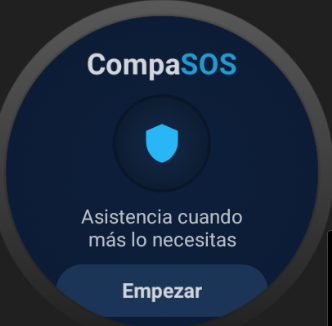
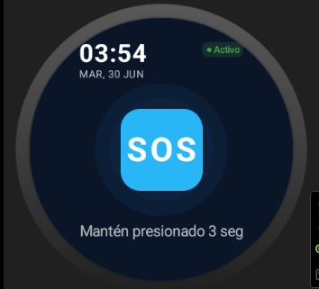
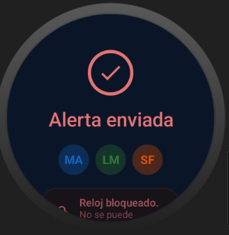
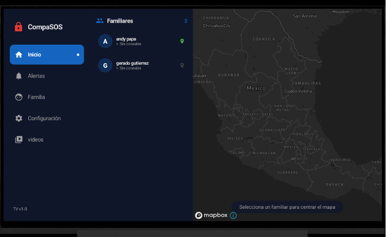
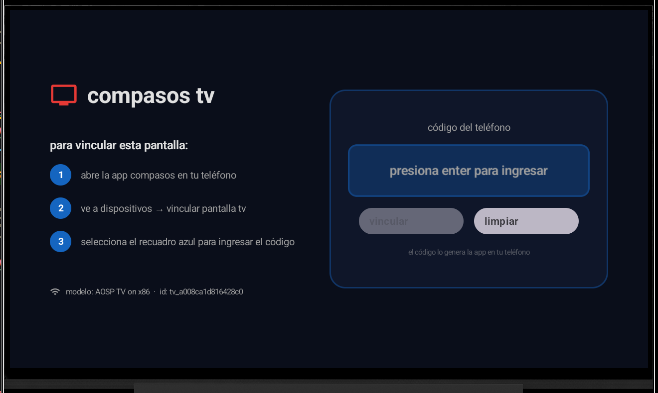
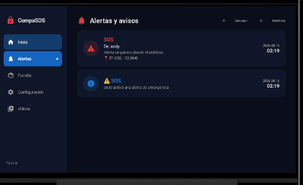
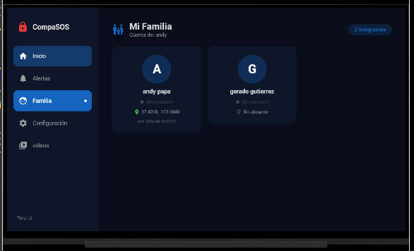
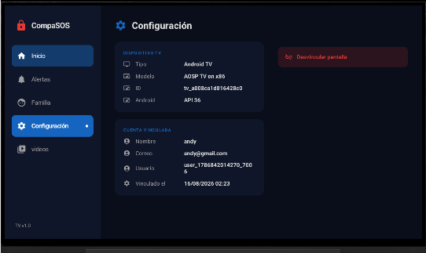
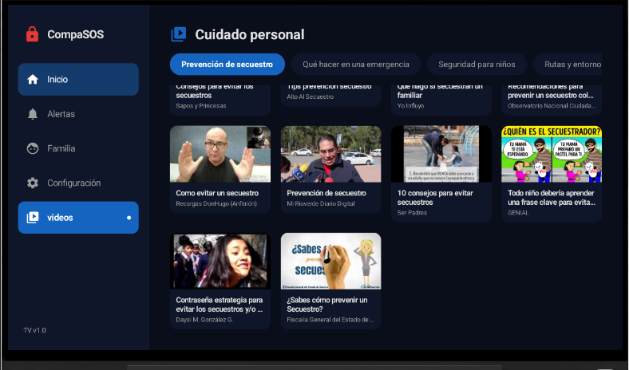

El **teléfono es el centro** de todo el sistema — esto ya estaba en tu lista de funcionalidades ("Funcionar como centro de configuración y sincronización del resto de los dispositivos"). El reloj nunca habla directo con la TV, ni la TV con el reloj: todo pasa por el teléfono, que es el único dispositivo con la base de datos completa (familiares, alertas, ubicaciones).

Hay **dos servicios en foreground corriendo en paralelo** dentro del teléfono, con conexiones MQTT independientes (`clientId` distintos), para que un problema en uno nunca afecte al otro:

| Servicio | Qué atiende | Topics | ¿Se modificó? |
|---|---|---|---|
| `AlertaMqttService` | Reloj (SOS, audio) y familiares (alertas, ubicación) | `compasos/alerta/+/sos`, `compasos/alerta/+/audio`, `compasos/familia/{userId}/alerta`, `compasos/familia/{userId}/ubicacion` | **No — intacto** |
| `TvSyncService` | Sincronización con las TVs vinculadas | `compasos/tv/{tvId}/*` | **Nuevo** |

## El contrato de topics

Todos los topics de este sistema cuelgan de tres raíces, definidas en `MqttConfig.kt` (idéntico en ambos módulos salvo el paquete):

| Topic | Sentido | Retained | Quién lo define |
|---|---|:---:|---|
| `compasos/alerta/{dispositivoId}/sos` | Reloj → Teléfono | no | **No tocado** — flujo del reloj |
| `compasos/alerta/{dispositivoId}/audio` | Reloj → Teléfono | no | **No tocado** — flujo del reloj |
| `compasos/familia/{usuarioId}/alerta` | Teléfono → Familiar | no | **No tocado** — flujo de familiares |
| `compasos/familia/{usuarioId}/ubicacion` | Teléfono → Familiar | no | **No tocado** — flujo de familiares |
| `compasos/vinculacion/tv/{codigo}/solicitud` | TV → Teléfono | no | Vinculación de una TV nueva |
| `compasos/vinculacion/tv/{codigo}/respuesta` | Teléfono → TV | no | Confirmación de vinculación |
| `compasos/tv/{tvId}/sesion` | Teléfono → TV | **sí** | Snapshot completo: usuario + familiares con ubicación |
| `compasos/tv/{tvId}/ubicacion/{usuarioId}` | Teléfono → TV | **sí** | Ubicación de UN familiar (el id va en el topic) |
| `compasos/tv/{tvId}/alerta` | Teléfono → TV | no | Alerta de emergencia (evento puntual) |
| `compasos/tv/{tvId}/notificacion` | Teléfono → TV | no | Notificación informativa |
| `compasos/tv/{tvId}/telefono_estado` | Teléfono → TV | **sí** | Presencia del teléfono (es su Last Will) |
| `compasos/tv/{tvId}/estado` | TV → Teléfono | **sí** | Presencia de la TV (es su Last Will) |

La TV se suscribe con **un solo wildcard**: `compasos/tv/{tvId}/#`. Si se agrega un subtopic nuevo del lado del teléfono, le llega a la TV sin tocar una sola línea de ese lado.

### Por qué `retained` importa

Sin `retained`, cuando enciendes la TV la pantalla queda vacía hasta que el teléfono manda el siguiente latido (hasta 20 s de "no pasa nada"). Con `retained`, el broker le entrega el último mensaje **en el instante en que se suscribe** — por eso el *estado* (sesión, última ubicación conocida, presencia) va retenido. Los *eventos* (una alerta puntual) **no** van retenido, porque si se retuviera, la TV "recibiría" la misma alerta de emergencia cada vez que se reinicia.

### Por qué Last Will and Testament (LWT)

Tanto el teléfono como la TV configuran un mensaje LWT al conectarse: si la conexión se corta de forma anormal (se cierra la app, se va la luz, se pierde el WiFi), el **broker mismo** publica ese mensaje en nombre del cliente caído. Así la contraparte se entera de la desconexión sin depender de que el dispositivo caído alcance a avisar.

## Flujo de vinculación de una TV nueva

1. En el teléfono, el usuario entra a "Vincular TV". `TvVinculacionViewModel.iniciarVinculacion()` genera un código de 6 caracteres, conecta MQTT y se suscribe a `compasos/vinculacion/tv/{codigo}/solicitud`. El código se muestra en pantalla.
2. En la TV, el usuario teclea ese mismo código. `VinculacionTvRepository.solicitarVinculacion()` se suscribe primero a `.../respuesta` (para no perderse la confirmación) y luego publica `{tvId, codigo, modelo}` en `.../solicitud`, **reintentando cada 3 s hasta 60 s** por si el teléfono todavía no se había suscrito.
3. El teléfono recibe la solicitud → `procesarSolicitudTv()`: responde por `.../respuesta` con los datos del usuario, guarda la TV en la tabla `dispositivos` (`tipo='tv'`), arma la sesión inicial **con las últimas ubicaciones reales** de cada familiar (sacadas de `historial_ubicacion`) y la publica retenida en `compasos/tv/{tvId}/sesion`. Por último llama a `TvSyncService.sincronizarAhora()` para no esperar al siguiente latido.
4. La TV recibe la respuesta → guarda `usuarioId/nombre/email` y marca `vinculado = true` en `ConfigTvEntity`.
5. El servicio `TvMqttService` de la TV ya estaba corriendo y suscrito a `compasos/tv/{tvId}/#` desde que arrancó la app (independiente de la vinculación), así que el snapshot retenido le llega de inmediato y lo guarda en Room. La UI, que observa Room con `Flow`, se repinta sola.
6. A partir de aquí, cada 20 s el teléfono vuelve a mandar el snapshot completo (late), y además cualquier SOS, alerta de familiar o ubicación nueva se empuja **al instante**, sin esperar el latido.

## Reloj (Wear OS)

Por instrucción explícita, **nada de `AlertaMqttService.kt` ni de los topics del reloj/familiares se modificó**. Se deja aquí completo como referencia, porque es la mitad del sistema que hace que el SOS del reloj llegue al teléfono y de ahí se reenvíe a la TV:

```kotlin
package com.utng.compasos_movil.config

import android.app.*
import android.content.Context
import android.content.Intent
import android.content.pm.ServiceInfo
import android.os.Build
import android.os.IBinder
import android.util.Log
import androidx.core.app.NotificationCompat
import com.utng.compasos_movil.AlertaPhoneRepository.AlertaPhoneRepository
import com.utng.compasos_movil.data.AppDatabase
import com.utng.compasos_movil.utils.SessionManager
import kotlinx.coroutines.*
import org.eclipse.paho.client.mqttv3.*
import org.eclipse.paho.client.mqttv3.persist.MemoryPersistence

class AlertaMqttService : Service() {

    private val scope          = CoroutineScope(SupervisorJob() + Dispatchers.IO)
    private var mqttClient:    MqttClient? = null
    private lateinit var repository:     AlertaPhoneRepository
    private lateinit var sessionManager: SessionManager

    @Volatile private var familiarUserId: String? = null

    companion object {
        private const val CANAL_SVC    = "compasos_svc"
        private const val CANAL_SOS    = "compasos_sos"
        private const val NOTIF_SVC_ID = 9001
        private const val EXTRA_USER   = "usuario_id"

        fun iniciar(context: Context, userId: String? = null) {
            val intent = Intent(context, AlertaMqttService::class.java).apply {
                userId?.let { putExtra(EXTRA_USER, it) }
            }
            if (Build.VERSION.SDK_INT >= Build.VERSION_CODES.O)
                context.startForegroundService(intent)
            else
                context.startService(intent)
        }
    }

    override fun onCreate() {
        super.onCreate()
        sessionManager = SessionManager(applicationContext)
        crearCanales()

        if (Build.VERSION.SDK_INT >= Build.VERSION_CODES.Q) {
            startForeground(
                NOTIF_SVC_ID, notifServicio(),
                ServiceInfo.FOREGROUND_SERVICE_TYPE_LOCATION or
                        ServiceInfo.FOREGROUND_SERVICE_TYPE_DATA_SYNC
            )
        } else {
            startForeground(NOTIF_SVC_ID, notifServicio())
        }

        inicializarRepo()
        conectarYSuscribir()
    }

    override fun onStartCommand(intent: Intent?, flags: Int, startId: Int): Int {
        val userId = intent?.getStringExtra(EXTRA_USER)
            ?: sessionManager.obtenerUsuarioId()

        if (userId != null && userId != familiarUserId) {
            familiarUserId = userId
            Log.d("AlertaMqttSvc", "onStartCommand → userId: $userId")
            if (mqttClient?.isConnected == true) {
                scope.launch { suscribirFamiliar(userId) }
            }
        }
        return START_STICKY
    }

    override fun onBind(intent: Intent?): IBinder? = null

    override fun onDestroy() {
        scope.cancel()
        try { mqttClient?.disconnect() } catch (_: Exception) {}
        super.onDestroy()
    }

    // ── Init ──────────────────────────────────────────────────────────────────

    private fun inicializarRepo() {
        val db = AppDatabase.getInstance(applicationContext)
        repository = AlertaPhoneRepository(
            alertaDao         = db.alertaDao(),
            ubicacionDao      = db.ubicacionDao(),
            audioDao          = db.audioDao(),
            notificacionDao   = db.notificacionDao(),
            familiaUsuarioDao = db.familiaUsuarioDao(),
            dispositivoDao    = db.dispositivoDao(),
            sessionManager    = sessionManager,
            context           = applicationContext
        )
    }

    // ── MQTT ──────────────────────────────────────────────────────────────────

    private fun conectarYSuscribir() {
        scope.launch {
            try {
                val clientId = "compasos_phone_${System.currentTimeMillis()}"
                mqttClient = MqttClient(
                    MqttConfig.BROKER_URL, clientId, MemoryPersistence()
                ).apply {
                    connect(MqttConnectOptions().apply {
                        isCleanSession       = true
                        connectionTimeout    = MqttConfig.TIMEOUT_CONEXION
                        keepAliveInterval    = MqttConfig.KEEP_ALIVE
                        isAutomaticReconnect = true
                    })
                }
                Log.d("AlertaMqttSvc", "Conectado al broker")

                // El reloj — no se toca
                mqttClient!!.subscribe("${MqttConfig.TOPIC_ALERTA}/+/sos", 1) { _, msg ->
                    scope.launch { manejarSOS(String(msg.payload, Charsets.UTF_8)) }
                }
                mqttClient!!.subscribe("${MqttConfig.TOPIC_ALERTA}/+/audio", 1) { _, msg ->
                    scope.launch {
                        repository.procesarAudio(String(msg.payload, Charsets.UTF_8))
                    }
                }

                val userId = familiarUserId ?: sessionManager.obtenerUsuarioId()
                if (userId != null) {
                    familiarUserId = userId
                    suscribirFamiliar(userId)
                } else {
                    Log.w("AlertaMqttSvc",
                        "Sin sesión al conectar — esperando userId via onStartCommand")
                }

            } catch (e: Exception) {
                Log.e("AlertaMqttSvc", "Error MQTT: ${e.message}")
            }
        }
    }

    private suspend fun suscribirFamiliar(userId: String) {
        try {
            val topicAlerta    = "${MqttConfig.TOPIC_FAMILIA}/$userId/alerta"
            val topicUbicacion = "${MqttConfig.TOPIC_FAMILIA}/$userId/ubicacion"

            mqttClient!!.subscribe(topicAlerta, 1) { _, msg ->
                scope.launch { manejarAlertaFamiliar(String(msg.payload, Charsets.UTF_8)) }
            }
            mqttClient!!.subscribe(topicUbicacion, 1) { _, msg ->
                scope.launch {
                    repository.procesarUbicacionFamiliar(String(msg.payload, Charsets.UTF_8))
                }
            }
            Log.d("AlertaMqttSvc", "✅ Suscrito a topics de familiar: $userId")
        } catch (e: Exception) {
            Log.e("AlertaMqttSvc", "Error suscribiendo familiar: ${e.message}")
        }
    }

    // ── Handlers ──────────────────────────────────────────────────────────────

    private suspend fun manejarSOS(payloadJson: String) {
        Log.d("AlertaMqttSvc", "SOS recibido: $payloadJson")
        val alerta = repository.procesarSOS(payloadJson) ?: return
        // procesarSOS() ya se encarga de notificarFamiliares() y notificarTvs()
        repository.iniciarRastreoEnVivo(alerta.id, scope)
        mostrarNotifSOS(
            alertaId    = alerta.id,
            dispositivo = alerta.dispositivoId ?: "Reloj",
            titulo      = "Alerta ${alerta.tipoAlerta} recibida"
        )
    }

    private suspend fun manejarAlertaFamiliar(payloadJson: String) {
        Log.d("AlertaMqttSvc", "Alerta familiar recibida: $payloadJson")
        val alerta = repository.procesarAlertaFamiliar(payloadJson) ?: run {
            Log.w("AlertaMqttSvc", "procesarAlertaFamiliar devolvió null")
            return
        }
        Log.d("AlertaMqttSvc", "Alerta familiar guardada: ${alerta.id}")
        mostrarNotifSOS(
            alertaId    = alerta.id,
            dispositivo = alerta.dispositivoId ?: "Familiar",
            titulo      = "Un familiar necesita ayuda"
        )
    }

    // ── Notificaciones ────────────────────────────────────────────────────────

    private fun mostrarNotifSOS(alertaId: String, dispositivo: String, titulo: String) {
        val intent = packageManager.getLaunchIntentForPackage(packageName)!!.apply {
            flags = Intent.FLAG_ACTIVITY_NEW_TASK or Intent.FLAG_ACTIVITY_CLEAR_TOP
            putExtra("nav_route", "alertaDetalle/$alertaId")
        }
        val pending = PendingIntent.getActivity(
            this, alertaId.hashCode(), intent,
            PendingIntent.FLAG_UPDATE_CURRENT or PendingIntent.FLAG_IMMUTABLE
        )
        val notif = NotificationCompat.Builder(this, CANAL_SOS)
            .setSmallIcon(android.R.drawable.ic_dialog_alert)
            .setContentTitle("⚠️ $titulo")
            .setContentText("Dispositivo: $dispositivo · Toca para ver la ubicación")
            .setPriority(NotificationCompat.PRIORITY_MAX)
            .setCategory(NotificationCompat.CATEGORY_ALARM)
            .setVibrate(longArrayOf(0, 500, 250, 500))
            .setAutoCancel(true)
            .setContentIntent(pending)
            .build()

        (getSystemService(NOTIFICATION_SERVICE) as NotificationManager)
            .notify(System.currentTimeMillis().toInt(), notif)
    }

    private fun notifServicio() = NotificationCompat.Builder(this, CANAL_SVC)
        .setSmallIcon(android.R.drawable.ic_menu_compass)
        .setContentTitle("CompaSOS activo")
        .setContentText("Escuchando alertas del reloj vinculado")
        .setPriority(NotificationCompat.PRIORITY_LOW)
        .build()

    private fun crearCanales() {
        if (Build.VERSION.SDK_INT >= Build.VERSION_CODES.O) {
            val nm = getSystemService(NOTIFICATION_SERVICE) as NotificationManager
            nm.createNotificationChannel(
                NotificationChannel(CANAL_SVC, "Servicio CompaSOS",
                    NotificationManager.IMPORTANCE_LOW)
            )
            nm.createNotificationChannel(
                NotificationChannel(CANAL_SOS, "Alertas de emergencia",
                    NotificationManager.IMPORTANCE_HIGH).apply {
                    enableVibration(true)
                    enableLights(true)
                }
            )
        }
    }
}
```

Fíjate en el comentario `// El reloj — no se toca` dentro de `conectarYSuscribir()`: ese único servicio atiende **tanto** al reloj como a los familiares, y es el puente hacia `AlertaPhoneRepository`, que es donde sí se agregaron los empujes hacia la TV (sin alterar la lógica original).

---

# ⚙️ Cómo levantar el proyecto completo (Teléfono + TV + Reloj)

## Requisitos

- Android Studio Hedgehog o superior, JDK 17.
- Un teléfono/emulador Android (móvil) y un dispositivo/emulador Android TV.
- El reloj Wear OS ya vinculado por Bluetooth al teléfono (ese emparejamiento es del sistema operativo, no de esta app).
- **Los tres dispositivos en la misma red**, y un broker MQTT (Mosquitto) accesible por IP desde los tres.
- Permisos de ubicación y notificaciones habilitados en el teléfono y en la TV.

## 1. Levantar el broker MQTT (Mosquitto)

```bash
# instalar (Linux)
sudo apt install mosquitto mosquitto-clients

# mosquitto.conf
listener 1883 0.0.0.0
allow_anonymous true
```

`0.0.0.0` es obligatorio: sin eso, Mosquitto solo escucha en `localhost` y ningún dispositivo de la red podrá conectarse, aunque en el logcat diga "conectado" (se conectaría a un broker distinto o fallaría en silencio según el caso).

```bash
sudo systemctl restart mosquitto
```

Anota la IP de la máquina donde corre esto en la red local (`hostname -I` en Linux, o revisa la configuración de red en Windows/Mac).

## 2. Configurar la misma IP del broker en los dos módulos

Esto es **lo primero que hay que revisar si algo no llega**: teléfono y TV deben apuntar exactamente al mismo broker.

```kotlin
// telefono: app/src/main/java/com/utng/compasos_movil/config/MqttConfig.kt
const val BROKER_URL = "tcp://TU_IP_AQUI:1883"

// tv: app/src/main/java/com/example/compasos_tv/config/MqttConfig.kt
const val BROKER_URL = "tcp://TU_IP_AQUI:1883"   // ← la MISMA IP
```

## 3. Configurar las claves de API (no se suben al repo)

Ambos módulos leen sus claves desde `app/src/main/res/values/developer-config.xml`, que normalmente está en `.gitignore` porque contiene credenciales. Si no existe, créalo en cada módulo:

```xml
<!-- app/src/main/res/values/developer-config.xml -->
<resources>
    <string name="mapbox_access_token" translatable="false">TU_MAPBOX_TOKEN_AQUI</string>
    <string name="youtube_api_key" translatable="false">TU_YOUTUBE_API_KEY_AQUI</string>
</resources>
```

- `mapbox_access_token` — token público de Mapbox (móvil, para el mapa). Se obtiene en [account.mapbox.com](https://account.mapbox.com).
- `youtube_api_key` — clave de YouTube Data API v3 (TV, módulo de videos de seguridad). Si no la configuras, el módulo de videos simplemente no carga (el código valida el placeholder y no truena: `if (apiKey.isBlank() || apiKey == "TU_YOUTUBE_API_KEY_AQUI") { ... return }`).

Además, **descargar el SDK de Mapbox requiere un segundo token** (el "downloads token", distinto del público de arriba), porque `settings.gradle.kts` en ambos módulos apunta a un Maven privado de Mapbox:

```kotlin
// settings.gradle.kts (ambos módulos)
maven {
    url = uri("https://api.mapbox.com/downloads/v2/releases/maven")
    credentials {
        username = "mapbox"
        password = providers.gradleProperty("MAPBOX_DOWNLOADS_TOKEN").getOrElse("")
    }
    authentication { create<BasicAuthentication>("basic") }
}
```

Ese token va en tu `~/.gradle/gradle.properties` (fuera del repo, nunca se comitea):

```properties
MAPBOX_DOWNLOADS_TOKEN=sk.xxxxxxxxxxxxxxxxxxxxxxxxxxxxxxxx
```

Se genera también en el dashboard de Mapbox, con scope `DOWNLOADS:READ`. Sin esto, el `sync` de Gradle falla al resolver `com.mapbox.maps:android`.

## 4. Compilar y ejecutar el módulo TELÉFONO

```bash
git clone -b dev https://github.com/gutierrezvargasandy1/CompaSOS_Movil.git
```

1. Abrir el proyecto en Android Studio.
2. Sincronizar Gradle (con los tokens del paso 3 ya configurados).
3. Ejecutar en un dispositivo o emulador Android.
4. Conceder los permisos de ubicación y notificaciones.
5. Registrar un perfil y contactos de confianza.
6. Iniciar sesión — esto arranca **los dos servicios en paralelo**: `AlertaMqttService.iniciar(...)` (reloj/familiares) y `TvSyncService.iniciar(...)` (TV). En el logcat deberías ver `TvSyncSvc: ✅ TvSyncService listo`.

## 5. Compilar y ejecutar el módulo TV

```bash
git clone -b dev https://github.com/gutierrezvargasandy1/CompaSOS_TV.git
```

1. Abrir el proyecto en Android Studio, con un dispositivo o emulador Android TV.
2. Sincronizar Gradle.
3. Ejecutar la app. En el logcat busca `TvMqttSvc: ✅ Suscrito a topics de TV: tv_xxxxx` — copia ese `tvId`, lo vas a necesitar si algún día quieres probar con `mosquitto_pub` a mano.

> Si ese log no aparece, revisa que `MainActivity.onCreate()` esté llamando a `TvMqttService.iniciar(applicationContext)` — sin esa línea el servicio queda declarado en el manifiesto pero nunca arranca, y la pantalla no se suscribe a nada.

## 6. Vincular la TV con la cuenta

1. En el **teléfono**: Dispositivos → ícono de vincular TV → aparece un código de 6 caracteres.
2. En la **TV**: pantalla de vinculación → teclear ese código.
3. La TV reintenta la solicitud sola cada 3 s durante 60 s, así que no importa si el teléfono tarda unos segundos en reaccionar.
4. Al confirmar, la TV navega a la pantalla principal y en unos segundos aparecen los familiares (algunos "sin ubicación" al principio — ver nota abajo).

## 7. Reloj (Wear OS)

El módulo del reloj **no se modificó** en este trabajo — sigue el mismo flujo de emparejamiento y comunicación que ya tenías validado (Bluetooth con el teléfono + los topics `compasos/alerta/+/sos` y `compasos/alerta/+/audio` descritos arriba). No requiere ningún paso adicional para que la sincronización con la TV funcione: en cuanto el reloj manda un SOS, `AlertaMqttService` lo procesa igual que siempre y **automáticamente** se reenvía a las TVs vinculadas.

## 8. Probar el flujo completo sin usar las tres apps

Con `mosquitto-clients` instalado, desde una terminal:

```bash
# Ver todo el tráfico (déjalo abierto en otra terminal)
mosquitto_sub -h TU_IP -t 'compasos/#' -v

# Simular una alerta llegando a una TV ya vinculada
mosquitto_pub -h TU_IP -t 'compasos/tv/tv_xxxxx/alerta' -m '{
  "alertaId":"a1","tipoAlerta":"SOS","descripcion":"Prueba manual",
  "emisorId":"u2","emisorNombre":"Luis Pérez",
  "latitud":21.15,"longitud":-101.68,"fecha":"2026-08-16 12:01:00"}'
```

Si eso pinta la alerta en la TV, la mitad de la TV está bien y cualquier problema restante está del lado del teléfono (o de la IP del broker).

## Dos cosas que son normales y no son bugs

- **La primera vez que compilas la TV con estos cambios, se re-vincula.** `AppDatabaseTv` subió de versión y usa `fallbackToDestructiveMigration()`, así que la base local se recrea una sola vez y hay que volver a teclear el código. Después de esa vez, ya no se pierde nada.
- **El primer minuto la pantalla se ve casi vacía.** `historial_ubicacion` (la tabla de la que la TV lee "última ubicación por persona") empieza sin datos. El dueño de la cuenta aparece en el mapa en unos ~20 s (el latido de `TvSyncService`); el resto de los familiares solo aparece cuando su propio teléfono dispara algo (un SOS, una alerta, o rastreo en vivo) — no hay, en el modelo de datos actual, un reporte continuo de ubicación de terceros sin que pase un evento.

---

# 📡 Código relevante — Módulo TELÉFONO

## `config/MqttConfig.kt`

Registro central de topics. Es lo primero que hay que mirar para entender a dónde publica y de dónde escucha cada parte del teléfono.

```kotlin
package com.utng.compasos_movil.config

object MqttConfig {

    /**
     * ⚠️ ESTA IP DEBE SER IDÉNTICA A LA DEL MÓDULO TV.
     */
    const val BROKER_URL = "tcp://192.168.1.102:1883"

    const val TIMEOUT_CONEXION = 10
    const val KEEP_ALIVE       = 60
    const val QOS              = 1

    const val TOPIC_VINCULACION = "compasos/vinculacion"
    const val TOPIC_DISPOSITIVO = "compasos/dispositivo"
    const val TOPIC_ALERTA      = "compasos/alerta"   // reloj — no se toca
    const val TOPIC_FAMILIA     = "compasos/familia"  // familiares — no se toca
    const val TOPIC_TV          = "compasos/tv"

    // ── Topics hacia la TV ────────────────────────────────────────────────────
    // La TV se suscribe a "compasos/tv/{tvId}/#", así que agregar un subtopic
    // nuevo aquí no obliga a tocar nada del otro lado.

    /** Snapshot completo: usuario + familiares con ubicación. RETAINED. */
    fun topicTvSesion(tvId: String) = "$TOPIC_TV/$tvId/sesion"

    /**
     * Ubicación de UN familiar. El usuarioId va EN EL TOPIC para que el broker
     * retenga la última posición de CADA uno.
     */
    fun topicTvUbicacion(tvId: String, usuarioId: String) =
        "$TOPIC_TV/$tvId/ubicacion/$usuarioId"

    /** Alerta de emergencia. NO retained (es evento, no estado). */
    fun topicTvAlerta(tvId: String) = "$TOPIC_TV/$tvId/alerta"

    /** Notificación informativa. NO retained. */
    fun topicTvNotificacion(tvId: String) = "$TOPIC_TV/$tvId/notificacion"

    /** Presencia del teléfono. RETAINED + es su Last Will. */
    fun topicTvEstadoTelefono(tvId: String) = "$TOPIC_TV/$tvId/telefono_estado"

    /** Cada cuánto el teléfono manda el snapshot completo a las TVs. */
    const val INTERVALO_LATIDO_MS = 20_000L
}
```

## `config/MqttManager.kt`

Cliente MQTT reutilizable, con re-suscripción automática tras reconectar (el punto que más "pantallas congeladas" causaba), `retained` y Last Will.

```kotlin
package com.utng.compasos_movil.config

import android.util.Log
import org.eclipse.paho.client.mqttv3.*
import org.eclipse.paho.client.mqttv3.persist.MemoryPersistence
import java.util.concurrent.ConcurrentHashMap

class MqttManager {

    companion object { private const val TAG = "MqttManager" }

    private var client: MqttClient? = null
    private val suscripciones = ConcurrentHashMap<String, (String, String) -> Unit>()
    private var onConexion: ((reconectado: Boolean) -> Unit)? = null

    val estaConectado: Boolean
        get() = client?.isConnected == true

    fun alConectar(bloque: (reconectado: Boolean) -> Unit) { onConexion = bloque }

    /** Llamar siempre desde Dispatchers.IO */
    @JvmOverloads
    fun conectar(
        clientId: String = "compasos_movil_${System.currentTimeMillis()}",
        lwtTopic: String? = null,
        lwtPayload: String? = null
    ) {
        if (estaConectado) return
        try {
            val c = MqttClient(MqttConfig.BROKER_URL, clientId, MemoryPersistence())

            c.setCallback(object : MqttCallbackExtended {
                override fun connectComplete(reconnect: Boolean, serverURI: String?) {
                    Log.d(TAG, if (reconnect) "🔄 Reconectado" else "✅ Conectado a $serverURI")
                    // Este callback corre en el hilo interno de Paho y subscribe()
                    // es bloqueante: si lo llamo aquí directo puedo trabar ese hilo.
                    if (reconnect) Thread { reaplicarSuscripciones() }.start()
                    onConexion?.invoke(reconnect)
                }
                override fun connectionLost(cause: Throwable?) {
                    Log.w(TAG, "⚠️ Conexión perdida: ${cause?.message}")
                }
                override fun messageArrived(topic: String?, message: MqttMessage?) {}
                override fun deliveryComplete(token: IMqttDeliveryToken?) {}
            })

            c.connect(MqttConnectOptions().apply {
                isCleanSession       = true
                connectionTimeout    = MqttConfig.TIMEOUT_CONEXION
                keepAliveInterval    = MqttConfig.KEEP_ALIVE
                isAutomaticReconnect = true
                if (lwtTopic != null && lwtPayload != null) {
                    setWill(lwtTopic, lwtPayload.toByteArray(Charsets.UTF_8), 1, true)
                }
            })

            client = c
            Log.d(TAG, "Conectado a: ${MqttConfig.BROKER_URL} como $clientId")
        } catch (e: MqttException) {
            Log.e(TAG, "Error al conectar: código=${e.reasonCode}, ${e.message}")
            throw e
        }
    }

    private fun reaplicarSuscripciones() {
        val c = client ?: return
        suscripciones.forEach { (topic, cb) ->
            try {
                c.subscribe(topic, MqttConfig.QOS) { t, msg ->
                    cb(t, String(msg.payload, Charsets.UTF_8))
                }
                Log.d(TAG, "↻ Re-suscrito a: $topic")
            } catch (e: Exception) {
                Log.e(TAG, "Error re-suscribiendo a $topic: ${e.message}")
            }
        }
    }

    fun desconectar() {
        try {
            client?.takeIf { it.isConnected }?.disconnect()
            Log.d(TAG, "Desconectado del broker")
        } catch (e: MqttException) {
            Log.e(TAG, "Error al desconectar: ${e.message}")
        } finally {
            suscripciones.clear()
            client = null
        }
    }

    /**
     * @param retained true = el broker guarda el mensaje y se lo entrega a quien
     *        se suscriba después. Úsalo para ESTADO, nunca para EVENTOS.
     */
    @JvmOverloads
    fun publicar(
        topic: String,
        payload: String,
        qos: Int = MqttConfig.QOS,
        retained: Boolean = false
    ) {
        val c = client ?: throw IllegalStateException("MQTT no conectado")
        c.publish(topic, MqttMessage(payload.toByteArray(Charsets.UTF_8)).apply {
            this.qos = qos
            this.isRetained = retained
        })
        Log.d(TAG, "► [$topic]${if (retained) "(retained)" else ""}: $payload")
    }

    @JvmOverloads
    fun publicarSeguro(
        topic: String, payload: String,
        qos: Int = MqttConfig.QOS, retained: Boolean = false
    ): Boolean = try {
        publicar(topic, payload, qos, retained); true
    } catch (e: Exception) {
        Log.e(TAG, "No se pudo publicar en $topic: ${e.message}"); false
    }

    fun suscribir(topic: String, onMensaje: (topic: String, payload: String) -> Unit) {
        val c = client ?: throw IllegalStateException("MQTT no conectado")
        suscripciones[topic] = onMensaje
        c.subscribe(topic, MqttConfig.QOS) { t, message ->
            val payload = String(message.payload, Charsets.UTF_8)
            Log.d(TAG, "◄ [$t]: $payload")
            onMensaje(t, payload)
        }
        Log.d(TAG, "Suscrito a: $topic")
    }

    fun desuscribir(topic: String) {
        try {
            suscripciones.remove(topic)
            client?.unsubscribe(topic)
            Log.d(TAG, "Desuscrito de: $topic")
        } catch (e: MqttException) {
            Log.e(TAG, "Error al desuscribir de $topic: ${e.message}")
        }
    }
}
```

## `config/TvSyncService.kt` — el corazón de la sincronización

Foreground service nuevo, corre aparte de `AlertaMqttService` con su propio `clientId`. Hace tres cosas: manda un latido cada 20 s con el snapshot completo (retained), guarda y publica el GPS del propio teléfono en cada latido, y expone funciones estáticas que `AlertaPhoneRepository` llama para empujar datos al instante.

```kotlin
package com.utng.compasos_movil.config

import android.app.*
import android.content.Context
import android.content.Intent
import android.content.pm.ServiceInfo
import android.os.Build
import android.os.IBinder
import android.util.Log
import androidx.core.app.NotificationCompat
import com.utng.compasos_movil.data.AppDatabase
import com.utng.compasos_movil.data.LocationRepository
import com.utng.compasos_movil.data.entity.DispositivoEntity
import com.utng.compasos_movil.data.entity.HistorialUbicacionEntity
import com.utng.compasos_movil.utils.SessionManager
import kotlinx.coroutines.*
import org.json.JSONArray
import org.json.JSONObject
import java.text.SimpleDateFormat
import java.util.*

class TvSyncService : Service() {

    private val scope = CoroutineScope(SupervisorJob() + Dispatchers.IO)
    private val mqtt  = MqttManager()
    private val fmt   = SimpleDateFormat("yyyy-MM-dd HH:mm:ss", Locale.getDefault())

    private lateinit var db: AppDatabase
    private lateinit var session: SessionManager
    private lateinit var locationRepo: LocationRepository

    @Volatile private var usuarioId: String? = null
    private var jobLatido: Job? = null

    companion object {
        private const val TAG        = "TvSyncSvc"
        private const val CANAL      = "compasos_tv_sync"
        private const val NOTIF_ID   = 9101
        private const val EXTRA_USER = "usuario_id"

        /** Ventana para considerar a alguien "en línea" (5 min sin reportar = offline). */
        private const val VENTANA_EN_LINEA_MS = 5 * 60_000L

        @Volatile private var instancia: TvSyncService? = null

        fun iniciar(context: Context, userId: String? = null) {
            val intent = Intent(context, TvSyncService::class.java).apply {
                userId?.let { putExtra(EXTRA_USER, it) }
            }
            if (Build.VERSION.SDK_INT >= Build.VERSION_CODES.O)
                context.startForegroundService(intent)
            else
                context.startService(intent)
        }

        fun detener(context: Context) {
            context.stopService(Intent(context, TvSyncService::class.java))
        }

        // ── API pública — llamar desde AlertaPhoneRepository ──────────────────

        /** Fuerza el snapshot completo ya mismo (tras vincular, tras editar familia). */
        fun sincronizarAhora() {
            val svc = instancia ?: return
            svc.scope.launch { svc.sincronizarTvs() }
        }

        /** Ubicación en vivo de un familiar → todas las TVs. */
        fun publicarUbicacion(
            usuarioId: String,
            latitud: Double,
            longitud: Double,
            fecha: String? = null
        ) {
            val svc = instancia ?: run {
                Log.w(TAG, "publicarUbicacion ignorada: TvSyncService no corre"); return
            }
            svc.scope.launch { svc.enviarUbicacion(usuarioId, latitud, longitud, fecha) }
        }

        /** Alerta de emergencia → todas las TVs. */
        fun publicarAlerta(
            alertaId: String,
            tipoAlerta: String,
            descripcion: String?,
            emisorId: String,
            emisorNombre: String?,
            latitud: Double?,
            longitud: Double?
        ) {
            val svc = instancia ?: run {
                Log.w(TAG, "publicarAlerta ignorada: TvSyncService no corre"); return
            }
            svc.scope.launch {
                val nombre = emisorNombre?.takeIf { it.isNotBlank() }
                    ?: svc.nombreDe(emisorId)

                val payload = JSONObject().apply {
                    put("alertaId",     alertaId)
                    put("tipoAlerta",   tipoAlerta)
                    put("descripcion",  descripcion ?: "")
                    put("emisorId",     emisorId)
                    put("emisorNombre", nombre)
                    latitud?.let  { put("latitud",  it) }
                    longitud?.let { put("longitud", it) }
                    put("fecha", svc.fmt.format(Date()))
                }.toString()

                // Sin retained: una alerta es un evento puntual.
                svc.paraCadaTv { tv ->
                    svc.mqtt.publicarSeguro(MqttConfig.topicTvAlerta(tv.id), payload)
                }
                // Y refresca el snapshot para que la ubicación del emisor
                // llegue al mapa sin esperar el latido.
                svc.sincronizarTvs()
            }
        }

        /** Notificación informativa → todas las TVs. */
        fun publicarNotificacion(
            notificacionId: String,
            alertaId: String?,
            titulo: String,
            mensaje: String,
            tipo: String = "info"
        ) {
            val svc = instancia ?: return
            svc.scope.launch {
                val payload = JSONObject().apply {
                    put("notificacionId", notificacionId)
                    put("alertaId",       alertaId ?: "")
                    put("titulo",         titulo)
                    put("mensaje",        mensaje)
                    put("tipo",           tipo)
                    put("fecha",          svc.fmt.format(Date()))
                }.toString()
                svc.paraCadaTv { tv ->
                    svc.mqtt.publicarSeguro(MqttConfig.topicTvNotificacion(tv.id), payload)
                }
            }
        }
    }

    // ── Ciclo de vida ─────────────────────────────────────────────────────────

    override fun onCreate() {
        super.onCreate()
        db           = AppDatabase.getInstance(applicationContext)
        session      = SessionManager(applicationContext)
        locationRepo = LocationRepository(applicationContext)
        instancia    = this

        crearCanal()
        if (Build.VERSION.SDK_INT >= Build.VERSION_CODES.Q) {
            startForeground(
                NOTIF_ID, notif(),
                ServiceInfo.FOREGROUND_SERVICE_TYPE_DATA_SYNC or
                        ServiceInfo.FOREGROUND_SERVICE_TYPE_LOCATION
            )
        } else {
            startForeground(NOTIF_ID, notif())
        }

        usuarioId = session.obtenerUsuarioId()
        conectar()
    }

    override fun onStartCommand(intent: Intent?, flags: Int, startId: Int): Int {
        val nuevo = intent?.getStringExtra(EXTRA_USER) ?: session.obtenerUsuarioId()
        if (nuevo != null && nuevo != usuarioId) {
            usuarioId = nuevo
            Log.d(TAG, "userId actualizado: $nuevo")
            scope.launch { sincronizarTvs() }
        }
        return START_STICKY
    }

    override fun onBind(intent: Intent?): IBinder? = null

    override fun onDestroy() {
        // Avísale a las TVs que este teléfono se va, en vez de dejarlas
        // mostrando datos viejos como si estuvieran vivos.
        try {
            runBlocking {
                withTimeoutOrNull(1500) {
                    paraCadaTv { tv ->
                        mqtt.publicarSeguro(
                            MqttConfig.topicTvEstadoTelefono(tv.id),
                            JSONObject().put("online", false).toString(),
                            retained = true
                        )
                    }
                }
            }
        } catch (_: Exception) {}

        jobLatido?.cancel()
        scope.cancel()
        mqtt.desconectar()
        instancia = null
        super.onDestroy()
    }

    // ── Conexión ──────────────────────────────────────────────────────────────

    private fun conectar() {
        scope.launch {
            var intentos = 0
            while (isActive) {
                try {
                    mqtt.alConectar { reconectado ->
                        scope.launch {
                            anunciarPresencia()
                            sincronizarTvs()
                        }
                        if (reconectado) Log.d(TAG, "Reconectado — snapshot reenviado")
                    }

                    mqtt.conectar(clientId = "compasos_tvsync_${System.currentTimeMillis()}")

                    anunciarPresencia()
                    iniciarLatido()
                    Log.d(TAG, "✅ TvSyncService listo")
                    return@launch

                } catch (e: Exception) {
                    intentos++
                    Log.e(TAG, "Error conectando (intento $intentos): ${e.message}")
                    delay(minOf(5_000L * intentos, 30_000L))
                }
            }
        }
    }

    private fun iniciarLatido() {
        jobLatido?.cancel()
        jobLatido = scope.launch {
            // Limpieza única al arrancar: el historial crece rápido.
            runCatching {
                db.historialUbicacionDao().limpiarViejas(
                    fmt.format(Date(System.currentTimeMillis() - 24 * 60 * 60_000L))
                )
            }
            while (isActive) {
                try {
                    registrarUbicacionPropia()
                    sincronizarTvs()
                } catch (e: Exception) {
                    Log.e(TAG, "Error en latido: ${e.message}")
                }
                delay(MqttConfig.INTERVALO_LATIDO_MS)
            }
        }
    }

    // ── Publicación ───────────────────────────────────────────────────────────

    /** Snapshot completo a todas las TVs, retained. */
    private suspend fun sincronizarTvs() {
        val uid = usuarioId ?: session.obtenerUsuarioId() ?: return
        if (!mqtt.estaConectado) return

        val tvs = db.dispositivoDao().obtenerTvsVinculados(uid)
        if (tvs.isEmpty()) return

        val payload = construirSesion(uid) ?: return
        tvs.forEach { tv ->
            mqtt.publicarSeguro(MqttConfig.topicTvSesion(tv.id), payload, retained = true)
        }
        Log.d(TAG, "↻ Snapshot enviado a ${tvs.size} TV(s)")
    }

    private suspend fun enviarUbicacion(
        idUsuario: String, lat: Double, lng: Double, fecha: String?
    ) {
        val payload = JSONObject().apply {
            put("usuarioId", idUsuario)
            put("latitud",   lat)
            put("longitud",  lng)
            put("fecha",     fecha ?: fmt.format(Date()))
            put("enLinea",   true)
        }.toString()

        paraCadaTv { tv ->
            // retained por familiar: el broker guarda la última posición de
            // CADA uno, no solo la del último que se movió.
            mqtt.publicarSeguro(
                MqttConfig.topicTvUbicacion(tv.id, idUsuario), payload, retained = true
            )
        }
    }

    /** Guarda el GPS del propio teléfono y lo empuja a las TVs. */
    private suspend fun registrarUbicacionPropia() {
        val uid = usuarioId ?: return
        val loc = locationRepo.obtenerUltimaUbicacion() ?: return
        val ahora = fmt.format(Date())

        runCatching {
            db.historialUbicacionDao().insertar(
                HistorialUbicacionEntity(
                    id        = UUID.randomUUID().toString(),
                    usuarioId = uid,
                    latitud   = loc.latitud,
                    longitud  = loc.longitud,
                    fecha     = ahora
                )
            )
        }
        enviarUbicacion(uid, loc.latitud, loc.longitud, ahora)
    }

    private suspend fun anunciarPresencia() {
        val online = JSONObject().apply {
            put("online", true)
            put("ts", System.currentTimeMillis())
        }.toString()
        paraCadaTv { tv ->
            mqtt.publicarSeguro(
                MqttConfig.topicTvEstadoTelefono(tv.id), online, retained = true
            )
        }
    }

    private suspend fun paraCadaTv(bloque: (DispositivoEntity) -> Unit) {
        val uid = usuarioId ?: session.obtenerUsuarioId() ?: return
        if (!mqtt.estaConectado) return
        db.dispositivoDao().obtenerTvsVinculados(uid).forEach(bloque)
    }

    // ── Construcción del snapshot ─────────────────────────────────────────────

    private suspend fun construirSesion(uid: String): String? {
        return try {
            val usuario = db.usuarioDao().obtenerPorId(uid) ?: run {
                Log.w(TAG, "Usuario $uid todavía no está en Room"); return null
            }

            val familiares = JSONArray()

            // El dueño va primero: la TV lo quiere ver en el mapa también.
            familiares.put(jsonFamiliar(uid, usuario.nombre, usuario.apellidoPaterno, "Yo"))

            for (rel in db.familiaUsuarioDao().obtenerTodosFamiliares(uid)) {
                val u = db.usuarioDao().obtenerPorId(rel.usuarioId) ?: continue
                familiares.put(
                    jsonFamiliar(u.id, u.nombre, u.apellidoPaterno, rel.rol ?: "Miembro")
                )
            }

            JSONObject().apply {
                put("usuarioId",  usuario.id)
                put("nombre",     usuario.nombre)
                put("email",      usuario.correo)
                put("fecha",      fmt.format(Date()))
                put("familiares", familiares)
            }.toString()

        } catch (e: Exception) {
            Log.e(TAG, "Error construyendo snapshot: ${e.message}", e)
            null
        }
    }

    private suspend fun jsonFamiliar(
        id: String, nombre: String, apellido: String?, rol: String
    ): JSONObject {
        val ubi = db.historialUbicacionDao().obtenerUltimaDeUsuario(id)
        return JSONObject().apply {
            put("usuarioId", id)
            put("nombre",    nombre)
            put("apellido",  apellido ?: "")
            ubi?.latitud?.let  { put("latitud",  it) }
            ubi?.longitud?.let { put("longitud", it) }
            put("fecha",   ubi?.fecha ?: "")
            put("enLinea", esReciente(ubi?.fecha))
            put("rol",     rol)
        }
    }

    private suspend fun nombreDe(id: String): String {
        val u = db.usuarioDao().obtenerPorId(id) ?: return "Familiar"
        return listOfNotNull(u.nombre, u.apellidoPaterno).joinToString(" ").trim()
            .ifBlank { "Familiar" }
    }

    private fun esReciente(fecha: String?): Boolean {
        if (fecha.isNullOrBlank()) return false
        return try {
            val t = fmt.parse(fecha)?.time ?: return false
            System.currentTimeMillis() - t < VENTANA_EN_LINEA_MS
        } catch (_: Exception) { false }
    }

    // ── Notificación persistente ──────────────────────────────────────────────

    private fun notif() = NotificationCompat.Builder(this, CANAL)
        .setSmallIcon(android.R.drawable.ic_menu_compass)
        .setContentTitle("CompaSOS — TV")
        .setContentText("Enviando ubicaciones y alertas a la pantalla")
        .setPriority(NotificationCompat.PRIORITY_LOW)
        .setOngoing(true)
        .build()

    private fun crearCanal() {
        if (Build.VERSION.SDK_INT >= Build.VERSION_CODES.O) {
            (getSystemService(NOTIFICATION_SERVICE) as NotificationManager)
                .createNotificationChannel(
                    NotificationChannel(
                        CANAL, "Sincronización con TV",
                        NotificationManager.IMPORTANCE_LOW
                    )
                )
        }
    }
}
```

## `data/dao/DispositivoDao.kt`

```kotlin
package com.utng.compasos_movil.data.dao

import androidx.room3.Dao
import androidx.room3.Insert
import androidx.room3.OnConflictStrategy
import androidx.room3.Query
import com.utng.compasos_movil.data.entity.DispositivoEntity

@Dao
interface DispositivoDao {

    /** OnConflictStrategy.REPLACE: permite re-vincular la MISMA TV sin crashear. */
    @Insert(onConflict = OnConflictStrategy.REPLACE)
    suspend fun insertar(dispositivo: DispositivoEntity)

    @Query("SELECT * FROM dispositivos")
    suspend fun obtenerTodos(): List<DispositivoEntity>

    @Query("SELECT * FROM dispositivos WHERE usuarioId = :usuarioId")
    suspend fun obtenerPorUsuario(usuarioId: String): List<DispositivoEntity>

    @Query("SELECT * FROM dispositivos WHERE id = :id")
    suspend fun obtenerPorId(id: String): DispositivoEntity?

    @Query("UPDATE dispositivos SET bateria = :bateria, conectado = :conectado WHERE id = :id")
    suspend fun actualizarEstado(id: String, bateria: Int?, conectado: Boolean)

    @Query("""
        SELECT * FROM dispositivos
        WHERE tipo = 'tv'
          AND usuarioId = :userId
          AND conectado = 1
    """)
    suspend fun obtenerTvsVinculados(userId: String): List<DispositivoEntity>

    @Query("UPDATE dispositivos SET conectado = 0 WHERE id = :id")
    suspend fun desconectar(id: String)
}
```

## `data/dao/HistorialUbicacionDao.kt`

Es la fuente de "última ubicación conocida de cada persona" — la tabla `ubicaciones` no sirve para esto porque cuelga de `alertaId`, no de `usuarioId`.

```kotlin
package com.utng.compasos_movil.data.dao

import androidx.room3.Dao
import androidx.room3.Insert
import androidx.room3.OnConflictStrategy
import androidx.room3.Query
import com.utng.compasos_movil.data.entity.HistorialUbicacionEntity
import com.utng.compasos_movil.data.entity.UsuarioEntity

@Dao
interface HistorialUbicacionDao {

    @Insert(onConflict = OnConflictStrategy.REPLACE)
    suspend fun insertar(historial: HistorialUbicacionEntity)

    @Query("SELECT * FROM historial_ubicacion WHERE usuarioId = :usuarioId ORDER BY fecha DESC")
    suspend fun obtenerPorUsuario(usuarioId: String): List<HistorialUbicacionEntity>

    @Query("SELECT * FROM usuarios WHERE id = :id LIMIT 1")
    suspend fun obtenerPorId(id: String): UsuarioEntity?

    @Query("""
        SELECT * FROM historial_ubicacion
        WHERE usuarioId = :usuarioId
        ORDER BY fecha DESC
        LIMIT 1
    """)
    suspend fun obtenerUltimaDeUsuario(usuarioId: String): HistorialUbicacionEntity?

    /** Evita que la tabla crezca sin límite con el latido del TvSyncService. */
    @Query("DELETE FROM historial_ubicacion WHERE fecha < :antesDe")
    suspend fun limpiarViejas(antesDe: String)
}
```

## `utils/TvMqttPublisher.kt`

```kotlin
package com.utng.compasos_movil.utils

import com.utng.compasos_movil.config.MqttConfig
import com.utng.compasos_movil.config.MqttManager
import com.utng.compasos_movil.config.TvSyncService
import org.json.JSONObject
import java.text.SimpleDateFormat
import java.util.*

object TvMqttPublisher {

    private val fmt = SimpleDateFormat("yyyy-MM-dd HH:mm:ss", Locale.getDefault())

    // ── Ruta recomendada: delega en TvSyncService (ya sabe qué TVs están
    // vinculadas, aplica retained donde toca y no revienta si el broker cae) ──

    object aTodasLasTvs {

        fun ubicacion(usuarioId: String, latitud: Double, longitud: Double) =
            TvSyncService.publicarUbicacion(usuarioId, latitud, longitud)

        fun alerta(
            alertaId: String,
            tipoAlerta: String,
            descripcion: String?,
            emisorId: String,
            emisorNombre: String? = null,
            latitud: Double? = null,
            longitud: Double? = null
        ) = TvSyncService.publicarAlerta(
            alertaId, tipoAlerta, descripcion, emisorId, emisorNombre, latitud, longitud
        )

        fun notificacion(
            notificacionId: String = UUID.randomUUID().toString(),
            alertaId: String? = null,
            titulo: String,
            mensaje: String,
            tipo: String = "info"
        ) = TvSyncService.publicarNotificacion(notificacionId, alertaId, titulo, mensaje, tipo)

        /** Fuerza el snapshot completo (usuario + familiares) ya mismo. */
        fun sincronizar() = TvSyncService.sincronizarAhora()
    }

    // ── Ruta directa: publica a UNA TV concreta con el MqttManager que le pases ──

    /** Topic: compasos/tv/{tvId}/alerta */
    fun enviarAlertaATv(
        mqtt: MqttManager,
        tvId: String,
        alertaId: String = UUID.randomUUID().toString(),
        tipoAlerta: String,
        descripcion: String,
        emisorNombre: String,
        emisorId: String,
        latitud: Double?,
        longitud: Double?
    ) {
        val payload = JSONObject().apply {
            put("alertaId",     alertaId)
            put("tipoAlerta",   tipoAlerta)
            put("descripcion",  descripcion)
            put("emisorNombre", emisorNombre)
            put("emisorId",     emisorId)
            latitud?.let  { put("latitud", it) }
            longitud?.let { put("longitud", it) }
            put("fecha", fmt.format(Date()))
        }.toString()

        mqtt.publicarSeguro(MqttConfig.topicTvAlerta(tvId), payload)
    }

    /**
     * Topic: compasos/tv/{tvId}/ubicacion/{usuarioId}
     * El usuarioId va EN EL TOPIC, para que retained guarde la posición de
     * cada familiar por separado.
     */
    fun enviarUbicacionATv(
        mqtt: MqttManager,
        tvId: String,
        usuarioId: String,
        latitud: Double,
        longitud: Double
    ) {
        val payload = JSONObject().apply {
            put("usuarioId", usuarioId)
            put("latitud",   latitud)
            put("longitud",  longitud)
            put("fecha",     fmt.format(Date()))
            put("enLinea",   true)
        }.toString()

        mqtt.publicarSeguro(
            MqttConfig.topicTvUbicacion(tvId, usuarioId), payload, retained = true
        )
    }

    /** Topic: compasos/tv/{tvId}/notificacion */
    fun enviarNotificacionATv(
        mqtt: MqttManager,
        tvId: String,
        notificacionId: String = UUID.randomUUID().toString(),
        alertaId: String?,
        titulo: String,
        mensaje: String,
        tipo: String = "info"
    ) {
        val payload = JSONObject().apply {
            put("notificacionId", notificacionId)
            put("alertaId",       alertaId ?: "")
            put("titulo",         titulo)
            put("mensaje",        mensaje)
            put("tipo",           tipo)
            put("fecha",          fmt.format(Date()))
        }.toString()

        mqtt.publicarSeguro(MqttConfig.topicTvNotificacion(tvId), payload)
    }
}
```

## `TvVinculacionModule/TvVinculacionViewModel.kt`

```kotlin
package com.utng.compasos_movil.TvVinculacionModule

import android.util.Log
import androidx.lifecycle.ViewModel
import androidx.lifecycle.ViewModelProvider
import androidx.lifecycle.viewModelScope
import com.utng.compasos_movil.config.MqttConfig
import com.utng.compasos_movil.config.MqttManager
import com.utng.compasos_movil.config.TvSyncService
import com.utng.compasos_movil.data.dao.DispositivoDao
import com.utng.compasos_movil.data.dao.FamiliaUsuarioDao
import com.utng.compasos_movil.data.dao.HistorialUbicacionDao
import com.utng.compasos_movil.data.dao.UsuarioDao
import com.utng.compasos_movil.data.entity.DispositivoEntity
import com.utng.compasos_movil.utils.SessionManager
import kotlinx.coroutines.Dispatchers
import kotlinx.coroutines.flow.MutableStateFlow
import kotlinx.coroutines.flow.StateFlow
import kotlinx.coroutines.flow.asStateFlow
import kotlinx.coroutines.flow.update
import kotlinx.coroutines.launch
import org.json.JSONArray
import org.json.JSONObject
import java.text.SimpleDateFormat
import java.util.*

sealed class EstadoVinculacionTv {
    object Inactivo : EstadoVinculacionTv()
    data class Generando(val codigo: String) : EstadoVinculacionTv()
    data class Exitosa(val modeloTv: String) : EstadoVinculacionTv()
    data class Error(val mensaje: String) : EstadoVinculacionTv()
}

class TvVinculacionViewModel(
    private val usuarioDao:        UsuarioDao,
    private val dispositivoDao:    DispositivoDao,
    private val familiaUsuarioDao: FamiliaUsuarioDao,
    private val historialDao:      HistorialUbicacionDao,
    private val sessionManager:    SessionManager
) : ViewModel() {

    companion object { private const val TAG = "TvVinculacionVM" }

    private val mqtt = MqttManager()
    private val fmt  = SimpleDateFormat("yyyy-MM-dd HH:mm:ss", Locale.getDefault())

    private val _estado = MutableStateFlow<EstadoVinculacionTv>(EstadoVinculacionTv.Inactivo)
    val estado: StateFlow<EstadoVinculacionTv> = _estado.asStateFlow()

    private var codigoActivo: String? = null

    fun iniciarVinculacion() {
        val codigo = generarCodigo()
        codigoActivo = codigo
        _estado.value = EstadoVinculacionTv.Generando(codigo)

        viewModelScope.launch(Dispatchers.IO) {
            try {
                if (!mqtt.estaConectado) {
                    mqtt.conectar(clientId = "compasos_vinc_${System.currentTimeMillis()}")
                }
                val topicSolicitud = "${MqttConfig.TOPIC_VINCULACION}/tv/$codigo/solicitud"
                mqtt.suscribir(topicSolicitud) { _, payload ->
                    viewModelScope.launch(Dispatchers.IO) {
                        procesarSolicitudTv(payload, codigo)
                    }
                }
                Log.d(TAG, "Esperando solicitud de la TV con código: $codigo")
            } catch (e: Exception) {
                Log.e(TAG, "Error al iniciar vinculación TV: ${e.message}")
                _estado.value = EstadoVinculacionTv.Error("Sin conexión al servidor MQTT")
            }
        }
    }

    private suspend fun procesarSolicitudTv(payload: String, codigoEsperado: String) {
        if (codigoActivo != codigoEsperado) return
        try {
            val json   = JSONObject(payload)
            val modelo = json.optString("modelo", "Android TV")
            val idTv   = json.optString("tvId",
                json.optString("dispositivoId", "tv_${UUID.randomUUID()}"))

            val userId = sessionManager.obtenerUsuarioId() ?: run {
                _estado.update { EstadoVinculacionTv.Error("Sin sesión activa") }
                return
            }
            val usuario = usuarioDao.obtenerPorId(userId)
            val nombre  = usuario?.nombre ?: sessionManager.obtenerUsuarioNombre() ?: ""
            val email   = usuario?.correo ?: sessionManager.obtenerUsuarioEmail()  ?: ""

            // 1. Responder a la TV con los datos de sesión
            mqtt.publicar(
                "${MqttConfig.TOPIC_VINCULACION}/tv/$codigoEsperado/respuesta",
                JSONObject().apply {
                    put("usuarioId", userId)
                    put("nombre",    nombre)
                    put("email",     email)
                    put("tvId",      idTv)
                    put("aceptada",  true)
                }.toString()
            )

            // 2. Guardar la TV en Room — TvSyncService la lee de aquí
            dispositivoDao.insertar(
                DispositivoEntity(
                    id               = idTv,
                    usuarioId        = userId,
                    tipo             = "tv",
                    modelo           = modelo,
                    fabricante       = json.optString("fabricante").ifBlank { null },
                    numeroSerie      = json.optString("numeroSerie").ifBlank { null },
                    tokenFcm         = null,
                    bateria          = null,
                    conectado        = true,
                    fechaVinculacion = fmt.format(Date())
                )
            )
            Log.d(TAG, "TV guardada en Room: $idTv")

            // 3. Sesión inicial CON ubicaciones reales
            val familiaresArray = JSONArray()
            familiaresArray.put(jsonFamiliar(userId, nombre, usuario?.apellidoPaterno, "Yo"))

            for (rel in familiaUsuarioDao.obtenerTodosFamiliares(userId)) {
                val u = usuarioDao.obtenerPorId(rel.usuarioId) ?: continue
                familiaresArray.put(
                    jsonFamiliar(u.id, u.nombre, u.apellidoPaterno, rel.rol ?: "Miembro")
                )
            }
            Log.d(TAG, "Sesión con ${familiaresArray.length()} familiar(es)")

            mqtt.publicar(
                MqttConfig.topicTvSesion(idTv),
                JSONObject().apply {
                    put("usuarioId",  userId)
                    put("nombre",     nombre)
                    put("email",      email)
                    put("fecha",      fmt.format(Date()))
                    put("familiares", familiaresArray)
                }.toString(),
                retained = true
            )

            // 4. Que el servicio empuje el snapshot completo ya mismo
            TvSyncService.sincronizarAhora()

            _estado.update { EstadoVinculacionTv.Exitosa(modelo) }
            Log.d(TAG, "✅ TV vinculada: $modelo")
        } catch (e: Exception) {
            Log.e(TAG, "Error procesando solicitud de TV: ${e.message}", e)
            _estado.update { EstadoVinculacionTv.Error("Error al procesar la solicitud de la TV") }
        }
    }

    private suspend fun jsonFamiliar(
        id: String, nombre: String, apellido: String?, rol: String
    ): JSONObject {
        val ubi = historialDao.obtenerUltimaDeUsuario(id)
        return JSONObject().apply {
            put("usuarioId", id)
            put("nombre",    nombre)
            put("apellido",  apellido ?: "")
            ubi?.latitud?.let  { put("latitud",  it) }
            ubi?.longitud?.let { put("longitud", it) }
            put("fecha",   ubi?.fecha ?: "")
            put("enLinea", ubi != null)
            put("rol",     rol)
        }
    }

    fun reiniciar() {
        codigoActivo?.let { cod ->
            viewModelScope.launch(Dispatchers.IO) {
                runCatching {
                    mqtt.desuscribir("${MqttConfig.TOPIC_VINCULACION}/tv/$cod/solicitud")
                }
            }
        }
        codigoActivo  = null
        _estado.value = EstadoVinculacionTv.Inactivo
    }

    override fun onCleared() {
        super.onCleared()
        viewModelScope.launch(Dispatchers.IO) { mqtt.desconectar() }
    }

    private fun generarCodigo(): String {
        val chars = "ABCDEFGHJKLMNPQRSTUVWXYZ23456789"
        return (1..6).map { chars.random() }.joinToString("")
    }
}

class TvVinculacionViewModelFactory(
    private val usuarioDao:        UsuarioDao,
    private val dispositivoDao:    DispositivoDao,
    private val familiaUsuarioDao: FamiliaUsuarioDao,
    private val historialDao:      HistorialUbicacionDao,
    private val sessionManager:    SessionManager
) : ViewModelProvider.Factory {
    @Suppress("UNCHECKED_CAST")
    override fun <T : ViewModel> create(modelClass: Class<T>): T =
        TvVinculacionViewModel(
            usuarioDao, dispositivoDao, familiaUsuarioDao, historialDao, sessionManager
        ) as T
}
```

`VincularTvScreen.kt` y `AppNavigation.kt` solo necesitan recibir y pasar el nuevo parámetro `historialUbicacionDao` a esta factory — es cableado, no lógica nueva.

## `AlertaPhoneRepository/AlertaPhoneRepository.kt`

El punto donde el flujo del reloj/familiares (sin cambios de lógica) y el flujo hacia la TV se cruzan. El constructor no cambió — `AlertaMqttService` lo sigue construyendo exactamente igual.

```kotlin
package com.utng.compasos_movil.AlertaPhoneRepository

import android.content.Context
import android.util.Log
import com.utng.compasos_movil.config.MqttConfig
import com.utng.compasos_movil.config.MqttManager
import com.utng.compasos_movil.config.TvSyncService
import com.utng.compasos_movil.data.AppDatabase
import com.utng.compasos_movil.data.LocationRepository
import com.utng.compasos_movil.data.UbicacionActual
import com.utng.compasos_movil.data.dao.AlertaDao
import com.utng.compasos_movil.data.dao.AudioDao
import com.utng.compasos_movil.data.dao.DispositivoDao
import com.utng.compasos_movil.data.dao.FamiliaUsuarioDao
import com.utng.compasos_movil.data.dao.NotificacionDao
import com.utng.compasos_movil.data.dao.UbicacionDao
import com.utng.compasos_movil.data.entity.AlertaEntity
import com.utng.compasos_movil.data.entity.AudioEntity
import com.utng.compasos_movil.data.entity.HistorialUbicacionEntity
import com.utng.compasos_movil.data.entity.NotificacionEntity
import com.utng.compasos_movil.data.entity.UbicacionEntity
import com.utng.compasos_movil.utils.SessionManager
import kotlinx.coroutines.CoroutineScope
import kotlinx.coroutines.Dispatchers
import kotlinx.coroutines.flow.catch
import kotlinx.coroutines.launch
import kotlinx.coroutines.withContext
import org.json.JSONObject
import java.text.SimpleDateFormat
import java.util.*

class AlertaPhoneRepository(
    private val alertaDao:         AlertaDao,
    private val ubicacionDao:      UbicacionDao,
    private val audioDao:          AudioDao,
    private val notificacionDao:   NotificacionDao,
    private val familiaUsuarioDao: FamiliaUsuarioDao,
    private val dispositivoDao:    DispositivoDao,
    private val sessionManager:    SessionManager,
    private val context:           Context
) {
    private val mqtt         = MqttManager()
    private val locationRepo = LocationRepository(context)
    private val fmt          = SimpleDateFormat("yyyy-MM-dd HH:mm:ss", Locale.getDefault())

    // Sin cambiar el constructor: mismo singleton que ya usa el servicio.
    private val historialDao = AppDatabase.getInstance(context).historialUbicacionDao()

    // ── SOS (viene del reloj) — SIN CAMBIOS DE LÓGICA ────────────────────────

    suspend fun procesarSOS(payloadJson: String): AlertaEntity? = withContext(Dispatchers.IO) {
        try {
            val json      = JSONObject(payloadJson)
            val usuarioId = sessionManager.obtenerUsuarioId() ?: run {
                Log.e("AlertaPhoneRepo", "No hay sesión activa")
                return@withContext null
            }

            val alertaId = json.optString("alertaId").ifBlank { UUID.randomUUID().toString() }

            val alerta = AlertaEntity(
                id            = alertaId,
                usuarioId     = usuarioId,
                dispositivoId = json.optString("dispositivoId", "desconocido"),
                tipoAlerta    = json.optString("tipoAlerta",    "SOS"),
                descripcion   = json.optString("descripcion",   "Alerta de pánico"),
                estado        = "activa",
                fecha         = json.optString("fecha", fmt.format(Date()))
            )
            alertaDao.insertar(alerta)
            Log.d("AlertaPhoneRepo", "Alerta guardada en Room: $alertaId")

            val ubicacion = locationRepo.obtenerUltimaUbicacion()
            if (ubicacion != null) {
                ubicacionDao.insertar(
                    UbicacionEntity(
                        id        = UUID.randomUUID().toString(),
                        alertaId  = alertaId,
                        latitud   = ubicacion.latitud,
                        longitud  = ubicacion.longitud,
                        precision = null,
                        velocidad = null,
                        fecha     = fmt.format(Date())
                    )
                )
                // ← también al historial por usuario, que es lo que lee la TV
                guardarEnHistorial(usuarioId, ubicacion.latitud, ubicacion.longitud)
            }

            notificarFamiliares(alerta, usuarioId, ubicacion?.latitud, ubicacion?.longitud)
            notificarTvs(alerta, usuarioId, ubicacion?.latitud, ubicacion?.longitud)
            alerta
        } catch (e: Exception) {
            Log.e("AlertaPhoneRepo", "Error procesando SOS: ${e.message}")
            null
        }
    }

    // ── Notificación a familiares (topic compasos/familia) — SIN CAMBIOS ─────

    private suspend fun notificarFamiliares(
        alerta:    AlertaEntity,
        usuarioId: String,
        latitud:   Double?,
        longitud:  Double?
    ) {
        try {
            val familiares = familiaUsuarioDao.obtenerTodosFamiliares(usuarioId)
            if (familiares.isEmpty()) {
                Log.d("AlertaPhoneRepo", "Sin familiares registrados para notificar")
                return
            }
            Log.d("AlertaPhoneRepo", "Notificando a ${familiares.size} familiar(es)")

            if (!mqtt.estaConectado) mqtt.conectar()

            val nombreEmisor = sessionManager.obtenerUsuarioNombre() ?: ""

            val payloadBase = JSONObject().apply {
                put("alertaId",      alerta.id)
                put("dispositivoId", alerta.dispositivoId)
                put("tipoAlerta",    alerta.tipoAlerta)
                put("descripcion",   alerta.descripcion)
                put("estado",        alerta.estado)
                put("fecha",         alerta.fecha)
                put("emisorId",      usuarioId)
                put("emisorNombre",  nombreEmisor)
                latitud?.let  { put("latitud",  it) }
                longitud?.let { put("longitud", it) }
            }.toString()

            for (familiar in familiares) {
                notificacionDao.insertar(
                    NotificacionEntity(
                        id           = UUID.randomUUID().toString(),
                        alertaId     = alerta.id,
                        destinatario = familiar.usuarioId,
                        tipo         = "SOS",
                        estado       = "enviada",
                        fecha        = fmt.format(Date())
                    )
                )
                mqtt.publicar(
                    "${MqttConfig.TOPIC_FAMILIA}/${familiar.usuarioId}/alerta",
                    payloadBase
                )
                Log.d("AlertaPhoneRepo", "Alerta enviada a familiar: ${familiar.usuarioId}")
            }
        } catch (e: Exception) {
            Log.e("AlertaPhoneRepo", "Error notificando familiares: ${e.message}")
        }
    }

    // ── Notificación a TVs vinculadas (NUEVO) ─────────────────────────────────

    private suspend fun notificarTvs(
        alerta:    AlertaEntity,
        usuarioId: String,
        latitud:   Double?,
        longitud:  Double?
    ) {
        try {
            val nombre = sessionManager.obtenerUsuarioNombre() ?: ""

            TvSyncService.publicarAlerta(
                alertaId     = alerta.id,
                tipoAlerta   = alerta.tipoAlerta ?: "SOS",
                descripcion  = alerta.descripcion ?: "Alerta de emergencia",
                emisorId     = usuarioId,
                emisorNombre = nombre,
                latitud      = latitud,
                longitud     = longitud
            )

            TvSyncService.publicarNotificacion(
                notificacionId = UUID.randomUUID().toString(),
                alertaId       = alerta.id,
                titulo         = "⚠️ ${alerta.tipoAlerta ?: "SOS"}",
                mensaje        = "$nombre activó una alerta de emergencia",
                tipo           = "sos"
            )
        } catch (e: Exception) {
            Log.e("AlertaPhoneRepo", "Error notificando TVs: ${e.message}")
        }
    }

    // ── Rastreo continuo de ubicación — SIN CAMBIOS DE LÓGICA ────────────────

    fun iniciarRastreoEnVivo(alertaId: String, scope: CoroutineScope) {
        scope.launch(Dispatchers.IO) {
            val usuarioId = sessionManager.obtenerUsuarioId()
            var contador = 0
            locationRepo.ubicacionEnVivo()
                .catch { e -> Log.e("AlertaPhoneRepo", "Error en rastreo: ${e.message}") }
                .collect { ubicacion ->
                    ubicacionDao.insertar(
                        UbicacionEntity(
                            id        = UUID.randomUUID().toString(),
                            alertaId  = alertaId,
                            latitud   = ubicacion.latitud,
                            longitud  = ubicacion.longitud,
                            precision = null,
                            velocidad = null,
                            fecha     = fmt.format(Date())
                        )
                    )
                    if (++contador % 3 == 0) {
                        usuarioId?.let {
                            guardarEnHistorial(it, ubicacion.latitud, ubicacion.longitud)
                        }
                        publicarUbicacionAFamiliares(alertaId, ubicacion)
                        publicarUbicacionATvs(ubicacion)
                    }
                }
        }
    }

    private suspend fun publicarUbicacionAFamiliares(
        alertaId: String,
        ubicacion: UbicacionActual
    ) {
        try {
            val usuarioId  = sessionManager.obtenerUsuarioId() ?: return
            val familiares = familiaUsuarioDao.obtenerTodosFamiliares(usuarioId)
            if (familiares.isEmpty()) return

            if (!mqtt.estaConectado) mqtt.conectar()

            val payload = JSONObject().apply {
                put("alertaId",  alertaId)
                put("tipo",      "ubicacion_viva")
                put("usuarioId", usuarioId)
                put("emisorId",  usuarioId)
                put("latitud",   ubicacion.latitud)
                put("longitud",  ubicacion.longitud)
                put("fecha",     fmt.format(Date()))
            }.toString()

            for (familiar in familiares) {
                mqtt.publicar(
                    "${MqttConfig.TOPIC_FAMILIA}/${familiar.usuarioId}/ubicacion",
                    payload
                )
            }
            Log.d("AlertaPhoneRepo", "Ubicación en vivo publicada a ${familiares.size} familiar(es)")
        } catch (e: Exception) {
            Log.e("AlertaPhoneRepo", "Error publicando ubicación a familiares: ${e.message}")
        }
    }

    private suspend fun publicarUbicacionATvs(ubicacion: UbicacionActual) {
        try {
            val usuarioId = sessionManager.obtenerUsuarioId() ?: return
            TvSyncService.publicarUbicacion(usuarioId, ubicacion.latitud, ubicacion.longitud)
        } catch (e: Exception) {
            Log.e("AlertaPhoneRepo", "Error publicando ubicación a TVs: ${e.message}")
        }
    }

    // ── Audio del reloj — SIN CAMBIOS ────────────────────────────────────────

    suspend fun procesarAudio(payloadJson: String) = withContext(Dispatchers.IO) {
        try {
            val json = JSONObject(payloadJson)
            audioDao.insertar(
                AudioEntity(
                    id       = json.optString("id", UUID.randomUUID().toString()),
                    alertaId = json.getString("alertaId"),
                    urlAudio = json.optString("audio"),
                    duracion = null,
                    fecha    = json.optString("fecha", fmt.format(Date()))
                )
            )
        } catch (e: Exception) {
            Log.e("AlertaPhoneRepo", "Error procesando audio: ${e.message}")
        }
    }

    // ── Alerta recibida como familiar ────────────────────────────────────────

    suspend fun procesarAlertaFamiliar(payloadJson: String): AlertaEntity? =
        withContext(Dispatchers.IO) {
            try {
                val json      = JSONObject(payloadJson)
                val usuarioId = sessionManager.obtenerUsuarioId() ?: return@withContext null
                val alertaId  = json.optString("alertaId").ifBlank {
                    UUID.randomUUID().toString()
                }

                alertaDao.obtenerPorId(alertaId)?.let { return@withContext it }

                val emisorId     = json.optString("emisorId")
                val emisorNombre = json.optString("emisorNombre")

                val alerta = AlertaEntity(
                    id            = alertaId,
                    usuarioId     = usuarioId,
                    dispositivoId = json.optString("dispositivoId"),
                    tipoAlerta    = json.optString("tipoAlerta", "SOS"),
                    descripcion   = json.optString("descripcion"),
                    estado        = json.optString("estado", "activa"),
                    fecha         = json.optString("fecha", fmt.format(Date()))
                )
                alertaDao.insertar(alerta)

                notificacionDao.insertar(
                    NotificacionEntity(
                        id           = UUID.randomUUID().toString(),
                        alertaId     = alertaId,
                        destinatario = usuarioId,
                        tipo         = "recibida",
                        estado       = "recibida",
                        fecha        = fmt.format(Date())
                    )
                )

                val lat = json.optDouble("latitud")
                val lng = json.optDouble("longitud")
                if (!lat.isNaN() && !lng.isNaN()) {
                    ubicacionDao.insertar(
                        UbicacionEntity(
                            id        = UUID.randomUUID().toString(),
                            alertaId  = alertaId,
                            latitud   = lat,
                            longitud  = lng,
                            precision = null,
                            velocidad = null,
                            fecha     = fmt.format(Date())
                        )
                    )
                    // ← la ubicación del EMISOR, indexada por su usuarioId,
                    //   para que la TV pueda pintarlo en el mapa
                    if (emisorId.isNotBlank()) guardarEnHistorial(emisorId, lat, lng)
                }

                // ← reenviar a las TVs
                TvSyncService.publicarAlerta(
                    alertaId     = alertaId,
                    tipoAlerta   = alerta.tipoAlerta ?: "SOS",
                    descripcion  = alerta.descripcion,
                    emisorId     = emisorId.ifBlank { usuarioId },
                    emisorNombre = emisorNombre.ifBlank { null },
                    latitud      = lat.takeIf { !it.isNaN() },
                    longitud     = lng.takeIf { !it.isNaN() }
                )
                TvSyncService.publicarNotificacion(
                    notificacionId = UUID.randomUUID().toString(),
                    alertaId       = alertaId,
                    titulo         = "⚠️ Un familiar necesita ayuda",
                    mensaje        = emisorNombre.ifBlank { "Un familiar" } +
                            " activó su alerta de emergencia",
                    tipo           = "sos"
                )

                alerta
            } catch (e: Exception) {
                Log.e("AlertaPhoneRepo", "Error procesando alerta de familiar: ${e.message}")
                null
            }
        }

    suspend fun procesarUbicacionFamiliar(payloadJson: String) = withContext(Dispatchers.IO) {
        try {
            val json     = JSONObject(payloadJson)
            val alertaId = json.optString("alertaId")
            if (alertaId.isBlank()) return@withContext

            val lat = json.optDouble("latitud")
            val lng = json.optDouble("longitud")
            if (lat.isNaN() || lng.isNaN()) return@withContext

            val fecha = json.optString("fecha", fmt.format(Date()))

            ubicacionDao.insertar(
                UbicacionEntity(
                    id        = UUID.randomUUID().toString(),
                    alertaId  = alertaId,
                    latitud   = lat,
                    longitud  = lng,
                    precision = null,
                    velocidad = null,
                    fecha     = fecha
                )
            )

            // ← guardar por usuarioId y empujar a la TV: este es el camino que
            //   hace que la ubicación EN VIVO de un familiar llegue a la
            //   pantalla, no solo la del dueño.
            val emisorId = json.optString("usuarioId")
                .ifBlank { json.optString("emisorId") }

            if (emisorId.isNotBlank()) {
                guardarEnHistorial(emisorId, lat, lng, fecha)
                TvSyncService.publicarUbicacion(emisorId, lat, lng, fecha)
            } else {
                Log.w("AlertaPhoneRepo",
                    "Ubicación de familiar sin usuarioId — no se puede mandar a la TV")
            }

            Log.d("AlertaPhoneRepo", "Ubicación de familiar guardada para alerta: $alertaId")
        } catch (e: Exception) {
            Log.e("AlertaPhoneRepo", "Error procesando ubicación de familiar: ${e.message}")
        }
    }

    // ── SOS desde el propio móvil — SIN CAMBIOS DE LÓGICA ────────────────────

    suspend fun crearSOSDesdeMovil(): AlertaEntity? = withContext(Dispatchers.IO) {
        try {
            val usuarioId = sessionManager.obtenerUsuarioId() ?: run {
                Log.e("AlertaPhoneRepo", "crearSOSDesdeMovil: sin sesión activa")
                return@withContext null
            }
            val alertaId      = UUID.randomUUID().toString()
            val dispositivoId = "movil_$usuarioId"

            val alerta = AlertaEntity(
                id            = alertaId,
                usuarioId     = usuarioId,
                dispositivoId = dispositivoId,
                tipoAlerta    = "SOS",
                descripcion   = "Alerta de pánico desde el teléfono",
                estado        = "activa",
                fecha         = fmt.format(Date())
            )
            alertaDao.insertar(alerta)

            val ubicacion = locationRepo.obtenerUltimaUbicacion()
            if (ubicacion != null) {
                ubicacionDao.insertar(
                    UbicacionEntity(
                        id        = UUID.randomUUID().toString(),
                        alertaId  = alertaId,
                        latitud   = ubicacion.latitud,
                        longitud  = ubicacion.longitud,
                        precision = null,
                        velocidad = null,
                        fecha     = fmt.format(Date())
                    )
                )
                guardarEnHistorial(usuarioId, ubicacion.latitud, ubicacion.longitud)
            }
            notificarFamiliares(alerta, usuarioId, ubicacion?.latitud, ubicacion?.longitud)
            notificarTvs(alerta, usuarioId, ubicacion?.latitud, ubicacion?.longitud)
            alerta
        } catch (e: Exception) {
            Log.e("AlertaPhoneRepo", "Error en crearSOSDesdeMovil: ${e.message}")
            null
        }
    }

    // ── Helper ────────────────────────────────────────────────────────────────

    private suspend fun guardarEnHistorial(
        usuarioId: String, lat: Double, lng: Double, fecha: String = fmt.format(Date())
    ) {
        runCatching {
            historialDao.insertar(
                HistorialUbicacionEntity(
                    id        = UUID.randomUUID().toString(),
                    usuarioId = usuarioId,
                    latitud   = lat,
                    longitud  = lng,
                    fecha     = fecha
                )
            )
        }.onFailure {
            Log.e("AlertaPhoneRepo", "No se pudo guardar en historial: ${it.message}")
        }
    }
}
```

## `MainActivity.kt` (teléfono)

```kotlin
package com.utng.compasos_movil

import android.Manifest
import android.content.Intent
import android.content.pm.PackageManager
import android.os.Build
import android.os.Bundle
import android.util.Log
import androidx.activity.ComponentActivity
import androidx.activity.compose.setContent
import androidx.activity.enableEdgeToEdge
import androidx.activity.result.contract.ActivityResultContracts
import androidx.core.content.ContextCompat
import com.utng.compasos_movil.config.AlertaMqttService
import com.utng.compasos_movil.config.TvSyncService
import com.utng.compasos_movil.data.AppDatabase
import com.utng.compasos_movil.navigation.AppNavigation
import com.utng.compasos_movil.ui.theme.CompaSOS_MovilTheme
import com.utng.compasos_movil.utils.SessionManager

class MainActivity : ComponentActivity() {

    private val permissionLauncher = registerForActivityResult(
        ActivityResultContracts.RequestMultiplePermissions()
    ) { permissions ->
        val locationGranted = permissions[Manifest.permission.ACCESS_FINE_LOCATION] == true ||
                permissions[Manifest.permission.ACCESS_COARSE_LOCATION] == true

        val fgsLocationGranted = if (Build.VERSION.SDK_INT >= Build.VERSION_CODES.Q) {
            permissions[Manifest.permission.FOREGROUND_SERVICE_LOCATION] == true
        } else true

        if (locationGranted && fgsLocationGranted) {
            iniciarServicios()
        } else {
            Log.e("MainActivity", "Permisos necesarios no otorgados")
        }
    }

    override fun onCreate(savedInstanceState: Bundle?) {
        super.onCreate(savedInstanceState)
        enableEdgeToEdge()

        val db = AppDatabase.getInstance(applicationContext)

        val usuarioDao            = db.usuarioDao()
        val perfilMedicoDao       = db.perfilMedicoDao()
        val familiaDao            = db.familiaDao()
        val familiaUsuarioDao     = db.familiaUsuarioDao()
        val contactoEmergenciaDao = db.contactoEmergenciaDao()
        val notificacionDao       = db.notificacionDao()
        val alertaDao             = db.alertaDao()
        val dispositivoDao        = db.dispositivoDao()
        val historialUbicacionDao = db.historialUbicacionDao()
        val ubicacionDao          = db.ubicacionDao()

        if (hasRequiredPermissions()) iniciarServicios() else requestPermissions()

        setContent {
            CompaSOS_MovilTheme {
                AppNavigation(
                    usuarioDao            = usuarioDao,
                    perfilMedicoDao       = perfilMedicoDao,
                    familiaDao            = familiaDao,
                    familiaUsuarioDao     = familiaUsuarioDao,
                    contactoEmergenciaDao = contactoEmergenciaDao,
                    notificacionDao       = notificacionDao,
                    alertaDao             = alertaDao,
                    dispositivoDao        = dispositivoDao,
                    historialUbicacionDao = historialUbicacionDao,
                    ubicacionDao          = ubicacionDao,
                    context               = applicationContext,
                    initialRoute          = intent.getStringExtra("nav_route")
                )
            }
        }
    }

    override fun onNewIntent(intent: Intent) {
        super.onNewIntent(intent)
        setIntent(intent)
    }

    /**
     * AlertaMqttService = reloj + familiares (NO se toca).
     * TvSyncService     = pantalla TV, corre en paralelo con su propio
     *                     clientId, no interfiere con el otro.
     */
    private fun iniciarServicios() {
        val userId = SessionManager(applicationContext).obtenerUsuarioId()
        AlertaMqttService.iniciar(applicationContext, userId)
        TvSyncService.iniciar(applicationContext, userId)
    }

    private fun hasRequiredPermissions(): Boolean {
        val locationGranted = ContextCompat.checkSelfPermission(
            this, Manifest.permission.ACCESS_FINE_LOCATION
        ) == PackageManager.PERMISSION_GRANTED

        val fgsLocationGranted = if (Build.VERSION.SDK_INT >= Build.VERSION_CODES.Q) {
            ContextCompat.checkSelfPermission(
                this, Manifest.permission.FOREGROUND_SERVICE_LOCATION
            ) == PackageManager.PERMISSION_GRANTED
        } else true

        return locationGranted && fgsLocationGranted
    }

    private fun requestPermissions() {
        val permissions = mutableListOf(
            Manifest.permission.ACCESS_FINE_LOCATION,
            Manifest.permission.ACCESS_COARSE_LOCATION
        )
        if (Build.VERSION.SDK_INT >= Build.VERSION_CODES.Q) {
            permissions.add(Manifest.permission.FOREGROUND_SERVICE_LOCATION)
        }
        if (Build.VERSION.SDK_INT >= Build.VERSION_CODES.TIRAMISU) {
            permissions.add(Manifest.permission.POST_NOTIFICATIONS)
        }
        permissionLauncher.launch(permissions.toTypedArray())
    }
}
```

`AuthViewModel.login()` hace lo mismo, junto a donde ya arranca `AlertaMqttService`:

```kotlin
AlertaMqttService.iniciar(getApplication(), usuario.id)
TvSyncService.iniciar(getApplication(), usuario.id)
```

## `AndroidManifest.xml` (teléfono)

```xml
<?xml version="1.0" encoding="utf-8"?>
<manifest xmlns:android="http://schemas.android.com/apk/res/android"
    xmlns:tools="http://schemas.android.com/tools">

    <uses-permission android:name="android.permission.INTERNET" />
    <uses-permission android:name="android.permission.ACCESS_NETWORK_STATE" />

    <uses-permission android:name="android.permission.ACCESS_FINE_LOCATION" />
    <uses-permission android:name="android.permission.ACCESS_COARSE_LOCATION" />

    <uses-permission android:name="android.permission.FOREGROUND_SERVICE" />
    <uses-permission android:name="android.permission.FOREGROUND_SERVICE_LOCATION" />
    <uses-permission android:name="android.permission.FOREGROUND_SERVICE_DATA_SYNC" />

    <uses-permission android:name="android.permission.ACCESS_MEDIA_LOCATION" />
    <uses-permission android:name="android.permission.POST_NOTIFICATIONS" />

    <application
        android:allowBackup="true"
        android:dataExtractionRules="@xml/data_extraction_rules"
        android:fullBackupContent="@xml/backup_rules"
        android:icon="@mipmap/ic_launcher"
        android:label="@string/app_name"
        android:roundIcon="@mipmap/ic_launcher_round"
        android:supportsRtl="true"
        android:theme="@style/Theme.CompaSOS_Movil">

        <meta-data
            android:name="MAPBOX_ACCESS_TOKEN"
            android:value="@string/mapbox_access_token" />

        <activity
            android:name=".MainActivity"
            android:exported="true"
            android:label="@string/app_name"
            android:theme="@style/Theme.CompaSOS_Movil"
            android:windowSoftInputMode="adjustResize">
            <intent-filter>
                <action android:name="android.intent.action.MAIN" />
                <category android:name="android.intent.category.LAUNCHER" />
            </intent-filter>
        </activity>

        <!-- Reloj + familiares — sin cambios -->
        <service
            android:name=".config.AlertaMqttService"
            android:foregroundServiceType="location|dataSync"
            android:exported="false" />

        <!-- Sincronización con la pantalla TV -->
        <service
            android:name=".config.TvSyncService"
            android:foregroundServiceType="location|dataSync"
            android:exported="false" />

    </application>

</manifest>
```

---

# 📡 Código relevante — Módulo TV

## `config/MqttConfig.kt`

```kotlin
package com.example.compasos_tv.config

object MqttConfig {

    /** ⚠️ TIENE QUE SER LA MISMA IP QUE EN EL TELÉFONO. */
    const val BROKER_URL       = "tcp://192.168.1.102:1883"

    const val TIMEOUT_CONEXION = 10
    const val KEEP_ALIVE       = 60
    const val QOS              = 1

    const val TOPIC_TV          = "compasos/tv"
    const val TOPIC_VINCULACION = "compasos/vinculacion"

    /** UNA sola suscripción con wildcard en vez de tres sueltas. */
    fun topicTodoDeEstaTv(tvId: String) = "$TOPIC_TV/$tvId/#"

    fun topicSolicitud(codigo: String) = "$TOPIC_VINCULACION/tv/$codigo/solicitud"
    fun topicRespuesta(codigo: String) = "$TOPIC_VINCULACION/tv/$codigo/respuesta"

    /** Presencia de la propia TV (es su Last Will). */
    fun topicEstadoTv(tvId: String) = "$TOPIC_TV/$tvId/estado"

    /** Si el teléfono no da señales en este tiempo, la UI lo marca desconectado. */
    const val TIMEOUT_TELEFONO_MS = 90_000L
}
```

## `config/MqttManager.kt`

Refactorizado a **singleton** (`MqttManager.instancia`): antes `TvMqttService` y `VinculacionTvRepository` creaban cada uno el suyo, así que la confirmación de vinculación podía llegar a una conexión mientras el servicio escuchaba en la otra.

```kotlin
package com.example.compasos_tv.config

import android.util.Log
import org.eclipse.paho.client.mqttv3.*
import org.eclipse.paho.client.mqttv3.persist.MemoryPersistence
import java.util.concurrent.ConcurrentHashMap

class MqttManager private constructor() {

    companion object {
        private const val TAG = "TvMqtt"

        /** Instancia única para toda la app de TV. Úsala siempre. */
        val instancia: MqttManager by lazy { MqttManager() }
    }

    private var client: MqttClient? = null
    private val suscripciones = ConcurrentHashMap<String, (String, String) -> Unit>()
    private var onConexion: ((reconectado: Boolean) -> Unit)? = null

    val estaConectado: Boolean
        get() = client?.isConnected == true

    fun alConectar(bloque: (reconectado: Boolean) -> Unit) { onConexion = bloque }

    @Synchronized
    @JvmOverloads
    fun conectar(
        clientId: String = "compasos_tv_${System.currentTimeMillis()}",
        lwtTopic: String? = null,
        lwtPayload: String? = null
    ) {
        if (estaConectado) return

        val c = MqttClient(MqttConfig.BROKER_URL, clientId, MemoryPersistence())

        c.setCallback(object : MqttCallbackExtended {
            override fun connectComplete(reconnect: Boolean, serverURI: String?) {
                Log.d(TAG, if (reconnect) "🔄 Reconectado" else "✅ Conectado a $serverURI")
                if (reconnect) Thread { reaplicarSuscripciones() }.start()
                onConexion?.invoke(reconnect)
            }
            override fun connectionLost(cause: Throwable?) {
                Log.w(TAG, "⚠️ Conexión perdida: ${cause?.message}")
            }
            override fun messageArrived(topic: String?, message: MqttMessage?) {}
            override fun deliveryComplete(token: IMqttDeliveryToken?) {}
        })

        c.connect(MqttConnectOptions().apply {
            isCleanSession       = true
            connectionTimeout    = MqttConfig.TIMEOUT_CONEXION
            keepAliveInterval    = MqttConfig.KEEP_ALIVE
            isAutomaticReconnect = true
            if (lwtTopic != null && lwtPayload != null) {
                setWill(lwtTopic, lwtPayload.toByteArray(Charsets.UTF_8), 1, true)
            }
        })

        client = c
        Log.d(TAG, "Conectado al broker como $clientId")
    }

    private fun reaplicarSuscripciones() {
        val c = client ?: return
        suscripciones.forEach { (topic, cb) ->
            try {
                c.subscribe(topic, MqttConfig.QOS) { t, msg ->
                    cb(t, String(msg.payload, Charsets.UTF_8))
                }
                Log.d(TAG, "↻ Re-suscrito a: $topic")
            } catch (e: Exception) {
                Log.e(TAG, "Error re-suscribiendo a $topic: ${e.message}")
            }
        }
    }

    @JvmOverloads
    fun publicar(
        topic: String,
        payload: String,
        qos: Int = MqttConfig.QOS,
        retained: Boolean = false
    ) {
        val c = client ?: throw IllegalStateException("MQTT no conectado")
        c.publish(topic, MqttMessage(payload.toByteArray(Charsets.UTF_8)).apply {
            this.qos = qos
            this.isRetained = retained
        })
        Log.d(TAG, "► [$topic]${if (retained) "(retained)" else ""}: $payload")
    }

    @JvmOverloads
    fun publicarSeguro(
        topic: String, payload: String,
        qos: Int = MqttConfig.QOS, retained: Boolean = false
    ): Boolean = try {
        publicar(topic, payload, qos, retained); true
    } catch (e: Exception) {
        Log.e(TAG, "No se pudo publicar en $topic: ${e.message}"); false
    }

    fun suscribir(topic: String, onMensaje: (String, String) -> Unit) {
        val c = client ?: throw IllegalStateException("MQTT no conectado")
        suscripciones[topic] = onMensaje
        c.subscribe(topic, MqttConfig.QOS) { t, msg ->
            val payload = String(msg.payload, Charsets.UTF_8)
            Log.d(TAG, "◄ [$t]: $payload")
            onMensaje(t, payload)
        }
        Log.d(TAG, "Suscrito a: $topic")
    }

    fun desuscribir(topic: String) {
        try {
            suscripciones.remove(topic)
            client?.unsubscribe(topic)
        } catch (e: Exception) {
            Log.e(TAG, "Error al desuscribir de $topic: ${e.message}")
        }
    }

    fun desconectar() {
        try { client?.takeIf { it.isConnected }?.disconnect() } catch (_: Exception) {}
        suscripciones.clear()
        client = null
    }
}
```

## `services/TvMqttService.kt` — el servicio que hace vivir la pantalla

Incluye el objeto `EstadoTv`, que expone el estado de conexión como `StateFlow` para que la UI distinga tres situaciones que se ven igual si no las separas: sin broker, broker-pero-sin-teléfono, y todo-bien-pero-sin-datos-todavía.

```kotlin
package com.example.compasos_tv.services

import android.app.*
import android.content.Context
import android.content.Intent
import android.os.Build
import android.os.IBinder
import android.provider.Settings
import android.util.Log
import androidx.core.app.NotificationCompat
import com.example.compasos_tv.config.MqttConfig
import com.example.compasos_tv.config.MqttManager
import com.example.compasos_tv.data.entitys.AlertaTvEntity
import com.example.compasos_tv.data.entitys.AppDatabaseTv
import com.example.compasos_tv.data.entitys.FamiliarTvEntity
import com.example.compasos_tv.data.entitys.NotificacionTvEntity
import kotlinx.coroutines.*
import kotlinx.coroutines.flow.MutableStateFlow
import kotlinx.coroutines.flow.asStateFlow
import org.json.JSONObject
import java.text.SimpleDateFormat
import java.util.*

object EstadoTv {
    private val _conectadoBroker = MutableStateFlow(false)
    val conectadoBroker = _conectadoBroker.asStateFlow()

    private val _telefonoEnLinea = MutableStateFlow(false)
    val telefonoEnLinea = _telefonoEnLinea.asStateFlow()

    private val _ultimoMensaje = MutableStateFlow(0L)
    val ultimoMensaje = _ultimoMensaje.asStateFlow()

    private val _ultimoError = MutableStateFlow<String?>(null)
    val ultimoError = _ultimoError.asStateFlow()

    fun setBroker(v: Boolean)   { _conectadoBroker.value = v }
    fun setTelefono(v: Boolean) { _telefonoEnLinea.value = v }
    fun latido()                { _ultimoMensaje.value = System.currentTimeMillis() }
    fun setError(m: String?)    { _ultimoError.value = m }
}

class TvMqttService : Service() {

    private val scope = CoroutineScope(SupervisorJob() + Dispatchers.IO)
    private val mqtt  = MqttManager.instancia
    private lateinit var db: AppDatabaseTv
    private val fmt = SimpleDateFormat("yyyy-MM-dd HH:mm:ss", Locale.getDefault())

    companion object {
        private const val TAG       = "TvMqttSvc"
        private const val CANAL     = "compasos_tv_svc"
        private const val CANAL_SOS = "compasos_tv_sos"
        private const val NOTIF_ID  = 8001

        fun iniciar(context: Context) {
            val intent = Intent(context, TvMqttService::class.java)
            if (Build.VERSION.SDK_INT >= Build.VERSION_CODES.O)
                context.startForegroundService(intent)
            else
                context.startService(intent)
        }

        /** ID único de esta TV basado en Android ID */
        fun obtenerTvId(context: Context): String {
            val androidId = Settings.Secure.getString(
                context.contentResolver, Settings.Secure.ANDROID_ID
            )
            return "tv_$androidId"
        }
    }

    override fun onCreate() {
        super.onCreate()
        db = AppDatabaseTv.getInstance(applicationContext)
        crearCanales()
        startForeground(NOTIF_ID, notif())
        conectarYSuscribir()
        vigilarPresenciaTelefono()
    }

    override fun onStartCommand(intent: Intent?, flags: Int, startId: Int) = START_STICKY

    override fun onBind(intent: Intent?): IBinder? = null

    override fun onDestroy() {
        scope.cancel()
        mqtt.desconectar()
        EstadoTv.setBroker(false)
        super.onDestroy()
    }

    // ── MQTT ──────────────────────────────────────────────────────────────────

    private fun conectarYSuscribir() {
        scope.launch {
            val tvId = obtenerTvId(applicationContext)

            mqtt.alConectar { reconectado ->
                EstadoTv.setBroker(true)
                EstadoTv.setError(null)
                scope.launch {
                    mqtt.publicarSeguro(
                        MqttConfig.topicEstadoTv(tvId),
                        JSONObject().put("online", true)
                            .put("ts", System.currentTimeMillis()).toString(),
                        retained = true
                    )
                }
                if (reconectado) Log.d(TAG, "Reconectado — suscripciones restauradas")
            }

            var intentos = 0
            while (isActive) {
                try {
                    mqtt.conectar(
                        clientId   = "compasos_${tvId.take(24)}",
                        lwtTopic   = MqttConfig.topicEstadoTv(tvId),
                        lwtPayload = JSONObject().put("online", false).toString()
                    )

                    // UNA suscripción para todo lo de esta TV
                    mqtt.suscribir(MqttConfig.topicTodoDeEstaTv(tvId)) { topic, payload ->
                        EstadoTv.latido()
                        scope.launch { despachar(topic, payload) }
                    }

                    // Respuesta de vinculación, si ya hay un código guardado.
                    db.configTvDao().obtener()?.codigoVinculacion
                        ?.takeIf { it.isNotBlank() }
                        ?.let { cod ->
                            mqtt.suscribir(MqttConfig.topicRespuesta(cod)) { _, payload ->
                                scope.launch { procesarRespuestaVinculacion(payload) }
                            }
                        }

                    EstadoTv.setBroker(true)
                    Log.d(TAG, "✅ Suscrito a topics de TV: $tvId")
                    return@launch

                } catch (e: Exception) {
                    intentos++
                    EstadoTv.setBroker(false)
                    EstadoTv.setError("No se pudo conectar al servidor (${e.message})")
                    Log.e(TAG, "Error MQTT (intento $intentos): ${e.message}")
                    delay(minOf(5_000L * intentos, 30_000L))   // backoff hasta 30 s
                }
            }
        }
    }

    /** Reparte el mensaje según el tramo del topic después del tvId. */
    private suspend fun despachar(topic: String, payload: String) {
        // compasos/tv/{tvId}/sesion
        // compasos/tv/{tvId}/ubicacion/{usuarioId}
        // compasos/tv/{tvId}/alerta
        // compasos/tv/{tvId}/notificacion
        // compasos/tv/{tvId}/telefono_estado
        // compasos/tv/{tvId}/estado          ← el nuestro, se ignora
        val sub = topic.split("/").getOrNull(3) ?: return

        when (sub) {
            "sesion"          -> procesarSesion(payload)
            "ubicacion"       -> procesarUbicacion(payload)
            "alerta"          -> procesarAlerta(payload)
            "notificacion"    -> procesarNotificacion(payload)
            "telefono_estado" -> procesarEstadoTelefono(payload)
            "estado"          -> { /* nuestro propio retained */ }
            else              -> Log.d(TAG, "Subtopic no manejado: $sub")
        }
    }

    // ── Procesadores ──────────────────────────────────────────────────────────

    /** Sesión: usuario + lista de familiares con ubicación */
    private suspend fun procesarSesion(payloadJson: String) {
        try {
            val json   = JSONObject(payloadJson)
            val nombre = json.optString("nombre")
            val email  = json.optString("email")

            val config = db.configTvDao().obtener()
            if (config != null && config.vinculado) {
                db.configTvDao().guardar(
                    config.copy(
                        nombreUsuario       = nombre,
                        emailUsuario        = email,
                        ultimaActualizacion = System.currentTimeMillis()
                    )
                )
            }

            val familiaresArray = json.optJSONArray("familiares") ?: return
            for (i in 0 until familiaresArray.length()) {
                val f  = familiaresArray.getJSONObject(i)
                val id = f.optString("usuarioId")
                if (id.isBlank()) continue

                // ⚠️ guardarConservandoUbicacion, NO insertar():
                // insertar() con REPLACE borraba la ubicación en cada snapshot.
                db.familiarTvDao().guardarConservandoUbicacion(
                    FamiliarTvEntity(
                        usuarioId            = id,
                        nombre               = f.optString("nombre").ifBlank { "Familiar" },
                        apellido             = f.optString("apellido").ifBlank { null },
                        latitud              = f.optDouble("latitud").takeIf { !it.isNaN() },
                        longitud             = f.optDouble("longitud").takeIf { !it.isNaN() },
                        ultimaUbicacionFecha = f.optString("fecha").ifBlank { null },
                        enLinea              = f.optBoolean("enLinea", false)
                    )
                )
            }
            EstadoTv.setTelefono(true)
            Log.d(TAG, "Sesión actualizada: $nombre | ${familiaresArray.length()} familiar(es)")
        } catch (e: Exception) {
            Log.e(TAG, "Error procesando sesión: ${e.message}", e)
        }
    }

    /** Ubicación en vivo de un familiar específico */
    private suspend fun procesarUbicacion(payloadJson: String) {
        try {
            val json = JSONObject(payloadJson)
            val id   = json.optString("usuarioId")
            val lat  = json.optDouble("latitud")
            val lng  = json.optDouble("longitud")
            if (id.isBlank() || lat.isNaN() || lng.isNaN()) return

            val fecha = json.optString("fecha", fmt.format(Date()))

            db.familiarTvDao().actualizarUbicacion(id = id, lat = lat, lng = lng, fecha = fecha)
            db.familiarTvDao().marcarEnLinea(id, true)

            EstadoTv.setTelefono(true)
            Log.d(TAG, "📍 Ubicación de $id: $lat, $lng")
        } catch (e: Exception) {
            Log.e(TAG, "Error procesando ubicación: ${e.message}", e)
        }
    }

    /** Alerta de emergencia enviada desde el teléfono */
    private suspend fun procesarAlerta(payloadJson: String) {
        try {
            val json         = JSONObject(payloadJson)
            val emisorNombre = json.optString("emisorNombre").ifBlank { "Un familiar" }
            val tipo         = json.optString("tipoAlerta").ifBlank { "SOS" }
            val emisorId     = json.optString("emisorId")
            val lat          = json.optDouble("latitud")
            val lng          = json.optDouble("longitud")
            val fecha        = json.optString("fecha", fmt.format(Date()))

            db.alertaTvDao().insertar(
                AlertaTvEntity(
                    id           = json.optString("alertaId", UUID.randomUUID().toString()),
                    tipo         = tipo,
                    descripcion  = json.optString("descripcion"),
                    emisorNombre = emisorNombre,
                    emisorId     = emisorId,
                    latitud      = lat.takeIf { !it.isNaN() },
                    longitud     = lng.takeIf { !it.isNaN() },
                    fecha        = fecha,
                    leida        = false
                )
            )

            // Si venía con ubicación, aprovéchala para el mapa del emisor
            if (emisorId.isNotBlank() && !lat.isNaN() && !lng.isNaN()) {
                db.familiarTvDao().actualizarUbicacion(emisorId, lat, lng, fecha)
            }

            mostrarNotifAlerta(tipo, emisorNombre)
            EstadoTv.setTelefono(true)
            Log.d(TAG, "🚨 Alerta recibida de $emisorNombre")
        } catch (e: Exception) {
            Log.e(TAG, "Error procesando alerta: ${e.message}", e)
        }
    }

    /** Notificación informativa (no emergencia) */
    private suspend fun procesarNotificacion(payloadJson: String) {
        try {
            val json = JSONObject(payloadJson)
            db.notificacionTvDao().insertar(
                NotificacionTvEntity(
                    id       = json.optString("notificacionId", UUID.randomUUID().toString()),
                    alertaId = json.optString("alertaId").ifBlank { null },
                    titulo   = json.optString("titulo").ifBlank { "CompaSOS" },
                    mensaje  = json.optString("mensaje"),
                    tipo     = json.optString("tipo", "info"),
                    fecha    = json.optString("fecha", fmt.format(Date())),
                    leida    = false
                )
            )
            EstadoTv.setTelefono(true)
            Log.d(TAG, "🔔 Notificación recibida")
        } catch (e: Exception) {
            Log.e(TAG, "Error procesando notificación: ${e.message}", e)
        }
    }

    /** Presencia del teléfono (incluye su Last Will cuando se muere) */
    private fun procesarEstadoTelefono(payloadJson: String) {
        try {
            val online = JSONObject(payloadJson).optBoolean("online", false)
            EstadoTv.setTelefono(online)
            Log.d(TAG, if (online) "📱 Teléfono en línea" else "📱 Teléfono desconectado")
        } catch (e: Exception) {
            Log.e(TAG, "Error procesando estado del teléfono: ${e.message}")
        }
    }

    /** El teléfono confirma la vinculación con los datos del usuario */
    private suspend fun procesarRespuestaVinculacion(payloadJson: String) {
        try {
            val json = JSONObject(payloadJson)
            db.configTvDao().confirmarVinculacion(
                usuarioId = json.optString("usuarioId"),
                nombre    = json.optString("nombre"),
                email     = json.optString("email"),
                ts        = System.currentTimeMillis()
            )
            Log.d(TAG, "✅ TV vinculada con usuario: ${json.optString("nombre")}")
        } catch (e: Exception) {
            Log.e(TAG, "Error procesando vinculación: ${e.message}")
        }
    }

    // ── Vigilancia de presencia ───────────────────────────────────────────────

    private fun vigilarPresenciaTelefono() {
        scope.launch {
            while (isActive) {
                delay(20_000)
                val ultimo = EstadoTv.ultimoMensaje.value
                if (ultimo > 0 &&
                    System.currentTimeMillis() - ultimo > MqttConfig.TIMEOUT_TELEFONO_MS
                ) {
                    EstadoTv.setTelefono(false)
                    val corte = fmt.format(
                        Date(System.currentTimeMillis() - MqttConfig.TIMEOUT_TELEFONO_MS)
                    )
                    runCatching { db.familiarTvDao().marcarInactivosAntesDe(corte) }
                }
            }
        }
    }

    // ── Notificaciones ────────────────────────────────────────────────────────

    private fun mostrarNotifAlerta(tipo: String, emisor: String) {
        val notif = NotificationCompat.Builder(this, CANAL_SOS)
            .setSmallIcon(android.R.drawable.ic_dialog_alert)
            .setContentTitle("⚠️ Alerta $tipo")
            .setContentText("$emisor necesita ayuda")
            .setPriority(NotificationCompat.PRIORITY_MAX)
            .setCategory(NotificationCompat.CATEGORY_ALARM)
            .setAutoCancel(true)
            .build()
        (getSystemService(NOTIFICATION_SERVICE) as NotificationManager)
            .notify(System.currentTimeMillis().toInt(), notif)
    }

    private fun notif() = NotificationCompat.Builder(this, CANAL)
        .setSmallIcon(android.R.drawable.ic_menu_compass)
        .setContentTitle("CompaSOS TV")
        .setContentText("Conectado — recibiendo datos del teléfono")
        .setPriority(NotificationCompat.PRIORITY_LOW)
        .setOngoing(true)
        .build()

    private fun crearCanales() {
        if (Build.VERSION.SDK_INT >= Build.VERSION_CODES.O) {
            val nm = getSystemService(NOTIFICATION_SERVICE) as NotificationManager
            nm.createNotificationChannel(
                NotificationChannel(CANAL, "Servicio TV", NotificationManager.IMPORTANCE_LOW)
            )
            nm.createNotificationChannel(
                NotificationChannel(
                    CANAL_SOS, "Alertas de emergencia",
                    NotificationManager.IMPORTANCE_HIGH
                )
            )
        }
    }
}
```

## `services/VinculacionTvRepository.kt`

```kotlin
package com.example.compasos_tv.services

import android.content.Context
import android.os.Build
import android.util.Log
import com.example.compasos_tv.config.MqttConfig
import com.example.compasos_tv.config.MqttManager
import com.example.compasos_tv.data.entitys.AppDatabaseTv
import com.example.compasos_tv.data.entitys.ConfigTvEntity
import kotlinx.coroutines.*
import kotlinx.coroutines.flow.Flow
import org.json.JSONObject

class VinculacionTvRepository(private val context: Context) {

    private val db   = AppDatabaseTv.getInstance(context)
    private val dao  = db.configTvDao()
    private val mqtt = MqttManager.instancia   // ← compartida con TvMqttService

    companion object {
        private const val TAG = "VinculacionTv"
        private const val REINTENTO_MS = 3_000L
        private const val TIMEOUT_MS   = 60_000L
    }

    fun observarConfig(): Flow<ConfigTvEntity?> = dao.observar()

    /**
     * El código lo genera y muestra el TELÉFONO. El usuario lo lee ahí y lo
     * escribe aquí en la TV.
     * @return true si el teléfono confirmó dentro del timeout.
     */
    suspend fun solicitarVinculacion(
        codigo: String,
        onConfirmada: (usuarioId: String, nombre: String, email: String) -> Unit
    ): Boolean = withContext(Dispatchers.IO) {

        val tvId = TvMqttService.obtenerTvId(context)

        if (dao.obtener() == null) {
            dao.guardar(ConfigTvEntity(tvDeviceId = tvId))
        }
        dao.setCodigo(codigo)

        if (!mqtt.estaConectado) {
            try {
                mqtt.conectar(clientId = "compasos_${tvId.take(24)}")
            } catch (e: Exception) {
                Log.e(TAG, "No hay broker: ${e.message}")
                return@withContext false
            }
        }

        val topicRespuesta = MqttConfig.topicRespuesta(codigo)
        val confirmada = CompletableDeferred<Boolean>()

        // Suscribirse ANTES de publicar para no perder la respuesta
        mqtt.suscribir(topicRespuesta) { _, payload ->
            CoroutineScope(Dispatchers.IO).launch {
                try {
                    val json      = JSONObject(payload)
                    val usuarioId = json.optString("usuarioId")
                    val nombre    = json.optString("nombre")
                    val email     = json.optString("email")

                    dao.confirmarVinculacion(
                        usuarioId = usuarioId,
                        nombre    = nombre,
                        email     = email,
                        ts        = System.currentTimeMillis()
                    )
                    onConfirmada(usuarioId, nombre, email)
                    Log.d(TAG, "✅ Vinculación confirmada por el teléfono")
                    confirmada.complete(true)
                } catch (e: Exception) {
                    Log.e(TAG, "Error procesando respuesta: ${e.message}")
                    confirmada.complete(false)
                }
            }
        }

        val payload = JSONObject().apply {
            put("tvId",   tvId)
            put("codigo", codigo)
            put("modelo", Build.MODEL)
        }.toString()

        // Reintenta: el teléfono puede tardar en suscribirse.
        val reintentos = launch {
            while (isActive) {
                mqtt.publicarSeguro(MqttConfig.topicSolicitud(codigo), payload)
                Log.d(TAG, "Solicitud publicada con código: $codigo")
                delay(REINTENTO_MS)
            }
        }

        val ok = withTimeoutOrNull(TIMEOUT_MS) { confirmada.await() } ?: false

        reintentos.cancel()
        if (!ok) {
            Log.w(TAG, "⏱ El teléfono no confirmó en ${TIMEOUT_MS / 1000}s")
            mqtt.desuscribir(topicRespuesta)
        }
        ok
    }

    suspend fun desvincular() = withContext(Dispatchers.IO) {
        val tvId = TvMqttService.obtenerTvId(context)
        dao.obtener()?.codigoVinculacion?.takeIf { it.isNotBlank() }?.let {
            mqtt.desuscribir(MqttConfig.topicRespuesta(it))
        }
        // Limpia el retained del broker para que la TV no reviva datos viejos
        mqtt.publicarSeguro(MqttConfig.topicEstadoTv(tvId), "", retained = true)
        dao.desvincular()
    }
}
```

## `data/entitys/NotificacionTvEntity.kt`

```kotlin
package com.example.compasos_tv.data.entitys

import androidx.room.Entity
import androidx.room.PrimaryKey

/**
 * Notificaciones informativas del teléfono. Van aparte de AlertaTvEntity a
 * propósito: una alerta es una emergencia y sale en rojo; una notificación
 * es informativa.
 */
@Entity(tableName = "notificaciones_tv")
data class NotificacionTvEntity(
    @PrimaryKey
    val id:       String,
    val alertaId: String? = null,
    val titulo:   String,
    val mensaje:  String,
    val tipo:     String  = "info",
    val fecha:    String,
    val leida:    Boolean = false
)
```

## `data/entitys/NotificacionTvDao.kt`

```kotlin
package com.example.compasos_tv.data.entitys

import androidx.room.*
import kotlinx.coroutines.flow.Flow

@Dao
interface NotificacionTvDao {

    @Insert(onConflict = OnConflictStrategy.REPLACE)
    suspend fun insertar(notificacion: NotificacionTvEntity)

    @Query("SELECT * FROM notificaciones_tv ORDER BY fecha DESC LIMIT 50")
    fun observarRecientes(): Flow<List<NotificacionTvEntity>>

    @Query("SELECT * FROM notificaciones_tv ORDER BY fecha DESC")
    fun observarTodas(): Flow<List<NotificacionTvEntity>>

    @Query("SELECT COUNT(*) FROM notificaciones_tv WHERE leida = 0")
    fun contarNoLeidas(): Flow<Int>

    @Query("UPDATE notificaciones_tv SET leida = 1 WHERE id = :id")
    suspend fun marcarLeida(id: String)

    @Query("UPDATE notificaciones_tv SET leida = 1")
    suspend fun marcarTodasLeidas()
}
```

## `data/entitys/dao/FamiliarTvDao.kt`

La transacción `guardarConservandoUbicacion()` es la que arregla el bug de "los familiares pierden su ubicación cada pocos segundos": separa la actualización de perfil de la de ubicación, y solo pisa la ubicación cuando el snapshot trae una de verdad.

```kotlin
package com.example.compasos_tv.data.entitys

import androidx.room.*
import kotlinx.coroutines.flow.Flow

@Dao
interface FamiliarTvDao {

    @Insert(onConflict = OnConflictStrategy.REPLACE)
    suspend fun insertar(familiar: FamiliarTvEntity)

    @Query("""
        UPDATE familiares_tv
        SET latitud = :lat,
            longitud = :lng,
            ultimaUbicacionFecha = :fecha,
            enLinea = 1
        WHERE usuarioId = :id
    """)
    suspend fun actualizarUbicacion(id: String, lat: Double, lng: Double, fecha: String)

    @Query("SELECT * FROM familiares_tv ORDER BY enLinea DESC, nombre ASC")
    fun observarTodos(): Flow<List<FamiliarTvEntity>>

    @Query("UPDATE familiares_tv SET enLinea = 0")
    suspend fun marcarTodosDesconectados()

    @Insert(onConflict = OnConflictStrategy.IGNORE)
    suspend fun insertarSiNoExiste(familiar: FamiliarTvEntity): Long

    @Query("""
        UPDATE familiares_tv
        SET nombre = :nombre, apellido = :apellido
        WHERE usuarioId = :id
    """)
    suspend fun actualizarPerfil(id: String, nombre: String, apellido: String?)

    @Query("UPDATE familiares_tv SET enLinea = :enLinea WHERE usuarioId = :id")
    suspend fun marcarEnLinea(id: String, enLinea: Boolean)

    /** Los que no reportan desde hace rato dejan de estar "en línea". */
    @Query("UPDATE familiares_tv SET enLinea = 0 WHERE ultimaUbicacionFecha < :antesDe")
    suspend fun marcarInactivosAntesDe(antesDe: String)

    @Query("SELECT COUNT(*) FROM familiares_tv")
    suspend fun contar(): Int

    @Transaction
    suspend fun guardarConservandoUbicacion(f: FamiliarTvEntity) {
        val insertado = insertarSiNoExiste(f)
        if (insertado == -1L) {
            actualizarPerfil(f.usuarioId, f.nombre, f.apellido)
            if (f.latitud != null && f.longitud != null) {
                actualizarUbicacion(
                    id    = f.usuarioId,
                    lat   = f.latitud,
                    lng   = f.longitud,
                    fecha = f.ultimaUbicacionFecha ?: ""
                )
            }
            // Después de actualizarUbicacion, porque esa query fuerza enLinea=1
            marcarEnLinea(f.usuarioId, f.enLinea)
        }
    }
}
```

## `data/entitys/AppDatabaseTv.kt`

```kotlin
package com.example.compasos_tv.data.entitys

import android.content.Context
import androidx.room.*
import com.example.compasos_tv.data.entitys.dao.VideoTvDao

@Database(
    entities = [
        AlertaTvEntity::class,
        FamiliarTvEntity::class,
        ConfigTvEntity::class,
        VideoTvEntity::class,
        NotificacionTvEntity::class
    ],
    version = 3,                             // ← 2 → 3
    exportSchema = false
)
abstract class AppDatabaseTv : RoomDatabase() {

    abstract fun alertaTvDao():       AlertaTvDao
    abstract fun familiarTvDao():     FamiliarTvDao
    abstract fun configTvDao():       ConfigTvDao
    abstract fun videoTvDao():        VideoTvDao
    abstract fun notificacionTvDao(): NotificacionTvDao

    companion object {
        @Volatile private var INSTANCE: AppDatabaseTv? = null

        fun getInstance(context: Context): AppDatabaseTv =
            INSTANCE ?: synchronized(this) {
                INSTANCE ?: Room.databaseBuilder(
                    context.applicationContext,
                    AppDatabaseTv::class.java,
                    "compasos_tv.db"
                )
                    // Al subir a version 3 borra y recrea. Se pierde la
                    // vinculación guardada una vez; hay que re-vincular.
                    .fallbackToDestructiveMigration()
                    .build()
                    .also { INSTANCE = it }
            }
    }
}
```

## `MainActivity.kt` (TV)

```kotlin
package com.example.compasos_tv

import android.os.Bundle
import android.view.KeyEvent
import androidx.activity.ComponentActivity
import androidx.activity.compose.setContent
import com.example.compasos_tv.Navigation.TvNavigation
import com.example.compasos_tv.Screan.ManejadorTeclasReproductor
import com.example.compasos_tv.services.TvMqttService

class MainActivity : ComponentActivity() {

    override fun onCreate(savedInstanceState: Bundle?) {
        super.onCreate(savedInstanceState)

        // ⚠️ ESTA LÍNEA ERA LA QUE FALTABA. TvMqttService estaba declarado en
        // el manifiesto pero nadie lo arrancaba: por eso la TV nunca se
        // suscribía a ningún topic y no llegaba nada del teléfono, aunque el
        // broker y la vinculación estuvieran bien.
        TvMqttService.iniciar(applicationContext)

        setContent {
            TvNavigation()
        }
    }

    @Suppress("RestrictedApi")
    override fun dispatchKeyEvent(event: KeyEvent): Boolean {
        val manejado = ManejadorTeclasReproductor.actual?.invoke(event) ?: false
        return manejado || super.dispatchKeyEvent(event)
    }
}
```

## `AndroidManifest.xml` (TV)

```xml
<uses-permission android:name="android.permission.INTERNET"/>
<uses-permission android:name="android.permission.ACCESS_NETWORK_STATE"/>
<uses-permission android:name="android.permission.FOREGROUND_SERVICE"/>
<uses-permission android:name="android.permission.POST_NOTIFICATIONS"/>

<service android:name=".services.TvMqttService" android:exported="false"/>
```

## `Screan/TvAlertasScreen.kt` — bandeja unificada de alertas y notificaciones

```kotlin
package com.example.compasos_tv.Screan

import android.app.Application
import androidx.compose.foundation.background
import androidx.compose.foundation.border
import androidx.compose.foundation.focusable
import androidx.compose.foundation.layout.*
import androidx.compose.foundation.lazy.LazyColumn
import androidx.compose.foundation.lazy.items
import androidx.compose.foundation.shape.CircleShape
import androidx.compose.foundation.shape.RoundedCornerShape
import androidx.compose.material.icons.Icons
import androidx.compose.material.icons.filled.Info
import androidx.compose.material.icons.filled.Notifications
import androidx.compose.material.icons.filled.Warning
import androidx.compose.runtime.*
import androidx.compose.ui.Alignment
import androidx.compose.ui.Modifier
import androidx.compose.ui.draw.clip
import androidx.compose.ui.focus.onFocusChanged
import androidx.compose.ui.graphics.Color
import androidx.compose.ui.input.key.Key
import androidx.compose.ui.input.key.KeyEventType
import androidx.compose.ui.input.key.key
import androidx.compose.ui.input.key.onKeyEvent
import androidx.compose.ui.input.key.type
import androidx.compose.ui.platform.LocalContext
import androidx.compose.ui.text.font.FontWeight
import androidx.compose.ui.unit.dp
import androidx.compose.ui.unit.sp
import androidx.lifecycle.AndroidViewModel
import androidx.lifecycle.ViewModelProvider
import androidx.lifecycle.viewModelScope
import androidx.lifecycle.viewmodel.compose.viewModel
import androidx.tv.material3.ExperimentalTvMaterial3Api
import androidx.tv.material3.Icon
import androidx.tv.material3.Text
import com.example.compasos_tv.data.entitys.AppDatabaseTv
import com.example.compasos_tv.services.EstadoTv
import kotlinx.coroutines.flow.SharingStarted
import kotlinx.coroutines.flow.StateFlow
import kotlinx.coroutines.flow.combine
import kotlinx.coroutines.flow.stateIn
import kotlinx.coroutines.launch

private val ACard      = Color(0xFF0F1629)
private val ACardNueva = Color(0xFF0F1E2E)
private val ATexto     = Color(0xFFE0E0E0)
private val ASecund    = Color(0xFF9E9E9E)
private val ARojo      = Color(0xFFE53935)
private val AAzul      = Color(0xFF1976D2)
private val AVerde     = Color(0xFF4CAF50)

/** Fila unificada: sirve tanto para alertas como para notificaciones. */
data class ItemBandeja(
    val id: String,
    val esAlerta: Boolean,
    val titulo: String,
    val subtitulo: String?,
    val detalle: String?,
    val coords: String?,
    val fecha: String,
    val leida: Boolean
)

// ── ViewModel: la parte que explica "cómo funciona" ─────────────────────────

class TvAlertasViewModel(app: Application) : AndroidViewModel(app) {

    private val db = AppDatabaseTv.getInstance(app)

    /**
     * Alertas + notificaciones en una sola bandeja ordenada por fecha.
     * La pantalla no toca MQTT: observa Room, y Room la despierta sola en
     * cuanto TvMqttService escribe algo. MQTT → Room → Flow → Compose.
     */
    val items: StateFlow<List<ItemBandeja>> = combine(
        db.alertaTvDao().observarTodas(),
        db.notificacionTvDao().observarTodas()
    ) { alertas, notifs ->
        val lista = mutableListOf<ItemBandeja>()

        alertas.forEach { a ->
            lista += ItemBandeja(
                id        = a.id,
                esAlerta  = true,
                titulo    = a.tipo ?: "SOS",
                subtitulo = a.emisorNombre?.let { "De: $it" },
                detalle   = a.descripcion,
                coords    = if (a.latitud != null && a.longitud != null)
                    "📍 %.4f, %.4f".format(a.latitud, a.longitud) else null,
                fecha     = a.fecha,
                leida     = a.leida
            )
        }
        notifs.forEach { n ->
            lista += ItemBandeja(
                id        = n.id,
                esAlerta  = false,
                titulo    = n.titulo,
                subtitulo = null,
                detalle   = n.mensaje,
                coords    = null,
                fecha     = n.fecha,
                leida     = n.leida
            )
        }
        lista.sortedByDescending { it.fecha }
    }.stateIn(viewModelScope, SharingStarted.WhileSubscribed(5_000), emptyList())

    val estadoConexion: StateFlow<Pair<Boolean, Boolean>> = combine(
        EstadoTv.conectadoBroker, EstadoTv.telefonoEnLinea
    ) { broker, telefono -> broker to telefono }
        .stateIn(viewModelScope, SharingStarted.WhileSubscribed(5_000), false to false)

    fun marcarLeida(item: ItemBandeja) {
        viewModelScope.launch {
            if (item.esAlerta) db.alertaTvDao().marcarLeida(item.id)
            else               db.notificacionTvDao().marcarLeida(item.id)
        }
    }

    class Factory(private val app: Application) : ViewModelProvider.Factory {
        @Suppress("UNCHECKED_CAST")
        override fun <T : androidx.lifecycle.ViewModel> create(modelClass: Class<T>): T =
            TvAlertasViewModel(app) as T
    }
}

// ── Screen ────────────────────────────────────────────────────────────────────

@OptIn(ExperimentalTvMaterial3Api::class)
@Composable
fun TvAlertasScreen() {
    val context = LocalContext.current
    val vm: TvAlertasViewModel = viewModel(
        factory = TvAlertasViewModel.Factory(context.applicationContext as Application)
    )
    val items    by vm.items.collectAsState()
    val conexion by vm.estadoConexion.collectAsState()
    val (brokerOk, telefonoOk) = conexion
    val noLeidas = items.count { !it.leida }

    Column(
        modifier            = Modifier.fillMaxSize(),
        verticalArrangement = Arrangement.spacedBy(16.dp)
    ) {
        Row(
            verticalAlignment     = Alignment.CenterVertically,
            horizontalArrangement = Arrangement.spacedBy(12.dp)
        ) {
            Icon(Icons.Default.Notifications, null, tint = ARojo, modifier = Modifier.size(30.dp))
            Text("Alertas y avisos", fontSize = 22.sp, fontWeight = FontWeight.Bold, color = ATexto)

            if (noLeidas > 0) {
                Box(
                    modifier = Modifier
                        .background(ARojo, CircleShape)
                        .padding(horizontal = 10.dp, vertical = 4.dp)
                ) {
                    Text(
                        "$noLeidas nuevo${if (noLeidas > 1) "s" else ""}",
                        fontSize = 12.sp, color = Color.White, fontWeight = FontWeight.Bold
                    )
                }
            }

            Spacer(Modifier.weight(1f))

            Punto(brokerOk); Spacer(Modifier.width(6.dp))
            Text("Servidor", fontSize = 12.sp, color = ASecund)
            Spacer(Modifier.width(16.dp))
            Punto(telefonoOk); Spacer(Modifier.width(6.dp))
            Text("Teléfono", fontSize = 12.sp, color = ASecund)
        }

        if (items.isEmpty()) {
            Box(modifier = Modifier.fillMaxSize(), contentAlignment = Alignment.Center) {
                Column(
                    horizontalAlignment = Alignment.CenterHorizontally,
                    verticalArrangement = Arrangement.spacedBy(12.dp)
                ) {
                    Icon(Icons.Default.Notifications, null, tint = ASecund, modifier = Modifier.size(64.dp))
                    Text(
                        when {
                            !brokerOk   -> "Sin conexión al servidor"
                            !telefonoOk -> "Esperando al teléfono…"
                            else        -> "Conectado. Sin alertas registradas"
                        },
                        fontSize = 20.sp, color = ATexto, fontWeight = FontWeight.SemiBold
                    )
                    Text(
                        "Las alertas y avisos de tus familiares aparecerán aquí",
                        fontSize = 14.sp, color = ASecund
                    )
                }
            }
        } else {
            LazyColumn(verticalArrangement = Arrangement.spacedBy(10.dp)) {
                items(items = items, key = { it.id }) { item ->
                    ItemBandejaCard(item = item, onClick = { vm.marcarLeida(item) })
                }
            }
        }
    }
}

@Composable
private fun Punto(ok: Boolean) {
    Box(
        Modifier.size(9.dp).clip(CircleShape)
            .background(if (ok) AVerde else Color(0xFF424242))
    )
}

@OptIn(ExperimentalTvMaterial3Api::class)
@Composable
private fun ItemBandejaCard(item: ItemBandeja, onClick: () -> Unit) {
    var tieneFoco by remember { mutableStateOf(false) }
    val acento = if (item.esAlerta) ARojo else AAzul

    Row(
        modifier = Modifier
            .fillMaxWidth()
            .clip(RoundedCornerShape(14.dp))
            .background(if (!item.leida) ACardNueva else ACard)
            .border(
                1.5.dp,
                when {
                    tieneFoco   -> AAzul
                    !item.leida -> acento.copy(alpha = 0.5f)
                    else        -> Color.Transparent
                },
                RoundedCornerShape(14.dp)
            )
            .onFocusChanged { tieneFoco = it.isFocused }
            .onKeyEvent { event ->
                if (event.type == KeyEventType.KeyUp &&
                    (event.key == Key.DirectionCenter || event.key == Key.Enter)
                ) { onClick(); true } else false
            }
            .focusable()
            .padding(20.dp),
        verticalAlignment     = Alignment.CenterVertically,
        horizontalArrangement = Arrangement.spacedBy(16.dp)
    ) {
        Box(
            modifier = Modifier.size(50.dp).background(acento.copy(alpha = 0.15f), CircleShape),
            contentAlignment = Alignment.Center
        ) {
            Icon(
                if (item.esAlerta) Icons.Default.Warning else Icons.Default.Info,
                null, tint = acento, modifier = Modifier.size(26.dp)
            )
        }

        Column(modifier = Modifier.weight(1f), verticalArrangement = Arrangement.spacedBy(4.dp)) {
            Row(
                verticalAlignment     = Alignment.CenterVertically,
                horizontalArrangement = Arrangement.spacedBy(10.dp)
            ) {
                Text(item.titulo, fontSize = 17.sp, fontWeight = FontWeight.Bold, color = acento)
                if (!item.leida) {
                    Box(
                        modifier = Modifier
                            .background(acento, RoundedCornerShape(20.dp))
                            .padding(horizontal = 8.dp, vertical = 2.dp)
                    ) {
                        Text("NUEVO", fontSize = 10.sp, fontWeight = FontWeight.Bold, color = Color.White)
                    }
                }
            }
            item.subtitulo?.let { Text(it, fontSize = 14.sp, color = ATexto) }
            item.detalle?.takeIf { it.isNotBlank() }
                ?.let { Text(it, fontSize = 13.sp, color = ASecund) }
            item.coords?.let { Text(it, fontSize = 12.sp, color = ASecund) }
        }

        Column(horizontalAlignment = Alignment.End) {
            Text(item.fecha.take(10), fontSize = 12.sp, color = ASecund)
            Text(
                item.fecha.drop(11).take(5),
                fontSize = 16.sp, fontWeight = FontWeight.Bold, color = ATexto
            )
        }
    }
}
```

---
# 📡 Código relevante — Módulo RELOJ (Wear OS)

Esta sección contiene las clases principales involucradas en la integración del módulo **CompaSOS_WearOS** con **MQTT**, la persistencia de la configuración mediante **Room**, el proceso de **vinculación con el teléfono** y el envío de **alertas SOS**.

---

## 1. `config/mqtt/MqttConfig.kt`

Contiene la configuración principal del broker MQTT y los topics utilizados por el reloj.

El reloj utiliza el mismo esquema general de topics que el teléfono, pero únicamente mantiene los topics necesarios para sus funciones.

```kotlin
package mx.edu.utng.compasos_wearos.config.mqtt

object MqttConfig {
    /**
     * Emulador Android → 10.0.2.2
     * (mapea al localhost de tu máquina)
     *
     * Dispositivo físico → IP local de tu máquina
     * en la misma WiFi.
     *
     * Ejemplo:
     * "tcp://192.168.1.100:1883"
     */
    const val BROKER_URL = "tcp://192.168.1.102:1883"

    const val TIMEOUT_CONEXION = 10   // segundos
    const val KEEP_ALIVE       = 60   // segundos
    const val QOS              = 1    // At least once

    // Topics
    const val TOPIC_VINCULACION = "compasos/vinculacion"
    const val TOPIC_DISPOSITIVO = "compasos/dispositivo"
    const val TOPIC_ALERTA      = "compasos/alerta"
}
```

### Topics utilizados

| Constante           | Topic                  | Uso                                       |
| ------------------- | ---------------------- | ----------------------------------------- |
| `TOPIC_VINCULACION` | `compasos/vinculacion` | Vinculación del reloj con el teléfono     |
| `TOPIC_DISPOSITIVO` | `compasos/dispositivo` | Comunicación relacionada con dispositivos |
| `TOPIC_ALERTA`      | `compasos/alerta`      | Envío de alertas y eventos SOS            |

---

# 2. `config/mqtt/MqttManager.kt`

Esta clase administra la conexión del reloj con el broker MQTT.

A diferencia de las implementaciones utilizadas en el teléfono y la TV, esta versión es más sencilla:

* No utiliza mensajes `retained`.
* No utiliza Last Will.
* `isAutomaticReconnect = false`.
* La reconexión debe realizarse manualmente cuando sea necesario.
* Utiliza `MemoryPersistence`.
* Utiliza QoS 1 por defecto.

```kotlin
package mx.edu.utng.compasos_wearos.config.mqtt

import android.util.Log
import org.eclipse.paho.client.mqttv3.*
import org.eclipse.paho.client.mqttv3.persist.MemoryPersistence

class MqttManager {

    companion object {
        private const val TAG = "MqttManager"
    }

    private var client: MqttClient? = null

    val estaConectado: Boolean
        get() = client?.isConnected == true

    /** Llamar siempre desde Dispatchers.IO */
    fun conectar() {
        if (estaConectado) return

        try {
            val clientId = "compasos_movil_${System.currentTimeMillis()}"

            client = MqttClient(
                MqttConfig.BROKER_URL,
                clientId,
                MemoryPersistence()
            )

            val options = MqttConnectOptions().apply {
                isCleanSession = true
                connectionTimeout = MqttConfig.TIMEOUT_CONEXION
                keepAliveInterval = MqttConfig.KEEP_ALIVE
                isAutomaticReconnect = false
            }

            client!!.connect(options)

            Log.d(
                TAG,
                "Conectado a: ${MqttConfig.BROKER_URL}"
            )

        } catch (e: MqttException) {

            Log.e(
                TAG,
                "Error al conectar: código=${e.reasonCode}, ${e.message}"
            )

            throw e
        }
    }

    fun desconectar() {
        try {
            client
                ?.takeIf { it.isConnected }
                ?.disconnect()

            Log.d(TAG, "Desconectado del broker")

        } catch (e: MqttException) {

            Log.e(
                TAG,
                "Error al desconectar: ${e.message}"
            )

        } finally {
            client = null
        }
    }

    /** Llamar desde Dispatchers.IO */
    fun publicar(
        topic: String,
        payload: String,
        qos: Int = MqttConfig.QOS
    ) {
        val c = client
            ?: throw IllegalStateException("MQTT no conectado")

        val message = MqttMessage(
            payload.toByteArray(Charsets.UTF_8)
        ).apply {
            this.qos = qos
        }

        c.publish(topic, message)

        Log.d(
            TAG,
            "► [$topic]: $payload"
        )
    }

    /**
     * El callback se ejecuta en el hilo interno de Paho.
     *
     * Desde el callback se recomienda utilizar
     * viewModelScope.launch para actualizar el estado.
     */
    fun suscribir(
        topic: String,
        onMensaje: (
            topic: String,
            payload: String
        ) -> Unit
    ) {
        val c = client
            ?: throw IllegalStateException("MQTT no conectado")

        c.subscribe(topic, MqttConfig.QOS) { t, message ->

            val payload = String(
                message.payload,
                Charsets.UTF_8
            )

            Log.d(
                TAG,
                "◄ [$t]: $payload"
            )

            onMensaje(t, payload)
        }

        Log.d(
            TAG,
            "Suscrito a: $topic"
        )
    }

    fun desuscribir(topic: String) {
        try {

            client?.unsubscribe(topic)

            Log.d(
                TAG,
                "Desuscrito de: $topic"
            )

        } catch (e: MqttException) {

            Log.e(
                TAG,
                "Error al desuscribir de $topic: ${e.message}"
            )
        }
    }
}
```

### Responsabilidades

```text
MqttManager
│
├── conectar()
│   └── Establece conexión con Mosquitto
│
├── desconectar()
│   └── Cierra la conexión
│
├── publicar()
│   └── Envía mensajes MQTT
│
├── suscribir()
│   └── Escucha mensajes MQTT
│
└── desuscribir()
    └── Cancela una suscripción
```

---

# 3. `data/entity/ConfigReloj.kt`

Representa la tabla principal de configuración del reloj.

Se utiliza una única fila con:

```text
id = 1
```

Esta tabla almacena:

* Configuración de emergencia.
* Configuración de detección de caídas.
* Configuración del sensor cardíaco.
* Modo discreto.
* Identificador del dispositivo vinculado.
* Nombre del dispositivo vinculado.
* Código MQTT pendiente de confirmación.

```kotlin
package mx.edu.utng.compasos_wearos.data.entity

import androidx.room.Entity
import androidx.room.PrimaryKey

@Entity(tableName = "config_reloj")
data class ConfigReloj(

    @PrimaryKey
    val id: Int = 1,

    val tiempoPanicoMs: Int = 3000,

    val tripleTabActivado: Boolean = true,

    val deteccionCaidasActiva: Boolean = true,

    val sensibilidadCaida: Float = 2.5f,

    val umbralBpmAlerta: Int = 130,

    val intervaloMonitoreoSeg: Int = 10,

    val audioAlActivarEmergencia: Boolean = true,

    val duracionAudioSeg: Int = 30,

    val modoDiscreto: Boolean = true,

    val deviceIdVinculado: String = "",

    val nombreDispositivoVinculado: String = "",

    // Código MQTT pendiente de confirmar
    val codigoVinculacion: String = "",

    val ultimaActualizacion: Long =
        System.currentTimeMillis()
)
```

---

# 4. `data/dao/ConfigRelojDao.kt`

El DAO permite consultar y modificar la configuración almacenada en Room.

```kotlin
package mx.edu.utng.compasos_wearos.data.dao

import androidx.room.*
import kotlinx.coroutines.flow.Flow
import mx.edu.utng.compasos_wearos.data.entity.ConfigReloj

@Dao
interface ConfigRelojDao {

    @Query(
        "SELECT * FROM config_reloj WHERE id = 1"
    )
    fun observarConfig(): Flow<ConfigReloj?>

    @Query(
        "SELECT * FROM config_reloj WHERE id = 1"
    )
    suspend fun obtenerConfig(): ConfigReloj?

    @Insert(
        onConflict = OnConflictStrategy.REPLACE
    )
    suspend fun guardarConfig(
        config: ConfigReloj
    )

    @Query(
        "UPDATE config_reloj SET umbralBpmAlerta = :bpm WHERE id = 1"
    )
    suspend fun setUmbralBpm(bpm: Int)

    @Query(
        "UPDATE config_reloj SET sensibilidadCaida = :valor WHERE id = 1"
    )
    suspend fun setSensibilidadCaida(valor: Float)

    @Query(
        """
        UPDATE config_reloj
        SET deviceIdVinculado = :id,
            nombreDispositivoVinculado = :nombre
        WHERE id = 1
        """
    )
    suspend fun setDispositivoVinculado(
        id: String,
        nombre: String
    )

    @Query(
        "UPDATE config_reloj SET modoDiscreto = :activo WHERE id = 1"
    )
    suspend fun setModoDiscreto(activo: Boolean)

    @Query(
        "UPDATE config_reloj SET tiempoPanicoMs = :ms WHERE id = 1"
    )
    suspend fun setTiempoPanico(ms: Int)

    // ── NUEVO: código de vinculación MQTT pendiente ──────────

    @Query(
        """
        UPDATE config_reloj
        SET codigoVinculacion = :codigo
        WHERE id = 1
        """
    )
    suspend fun setCodigoVinculacion(
        codigo: String
    )

    @Query(
        """
        UPDATE config_reloj
        SET codigoVinculacion = ''
        WHERE id = 1
        """
    )
    suspend fun limpiarCodigoVinculacion()
}
```

---

# 5. `data/VinculacionState.kt`

Define los diferentes estados posibles durante el proceso de vinculación.

```kotlin
package mx.edu.utng.compasos_wearos.data

sealed class VinculacionState {

    object Esperando : VinculacionState()

    /**
     * codigoEsperado != null
     * → viene del flujo MQTT.
     *
     * El usuario debe introducir el código.
     *
     * codigoEsperado == null
     * → viene del flujo Node/Wearable.
     *
     * La detección es automática.
     */
    data class SolicitudRecibida(
        val nombreTelefono: String,
        val codigoEsperado: String? = null,
        val usuarioId: String? = null
    ) : VinculacionState()

    data class CodigoIncorrecto(
        val codigoEsperado: String,
        val usuarioId: String?
    ) : VinculacionState()

    object Vinculando : VinculacionState()

    object Vinculado : VinculacionState()

    data class Error(
        val mensaje: String
    ) : VinculacionState()
}
```

### Estados

```text
VinculacionState
│
├── Esperando
│
├── SolicitudRecibida
│   ├── codigoEsperado
│   └── usuarioId
│
├── CodigoIncorrecto
│
├── Vinculando
│
├── Vinculado
│
└── Error
```

---

# 6. `data/VinculacionEvent.kt`

Representa los eventos que pueden ocurrir durante la vinculación.

```kotlin
package mx.edu.utng.compasos_wearos.data

sealed class VinculacionEvent {

    object BuscarReloj : VinculacionEvent()

    data class SolicitudVinculacion(
        val nombreTelefono: String
    ) : VinculacionEvent()

    object Confirmar : VinculacionEvent()

    object Cancelar : VinculacionEvent()

    object Desconectar : VinculacionEvent()

    // ── NUEVO: flujo MQTT con código ──────────────────────────

    data class SolicitudMqttRecibida(
        val codigo: String,
        val usuarioId: String
    ) : VinculacionEvent()

    object CodigoIncorrecto : VinculacionEvent()
}
```

---

# 7. `data/VinculacionManager.kt`

Administra el estado de la vinculación y mantiene un `StateFlow` para que la interfaz pueda reaccionar a los cambios.

También conserva compatibilidad con el flujo anterior mediante **Wearable Node API**.

```kotlin
package mx.edu.utng.compasos_wearos.data

import android.content.Context
import com.google.android.gms.wearable.Wearable
import kotlinx.coroutines.flow.MutableStateFlow
import kotlinx.coroutines.flow.StateFlow
import kotlinx.coroutines.flow.asStateFlow
import kotlinx.coroutines.tasks.await

class VinculacionManager {

    private val _estado =
        MutableStateFlow<VinculacionState>(
            VinculacionState.Esperando
        )

    val estado: StateFlow<VinculacionState> =
        _estado.asStateFlow()

    suspend fun detectarTelefonoConectado(
        context: Context
    ) {
        try {

            val nodos =
                Wearable
                    .getNodeClient(context)
                    .connectedNodes
                    .await()

            val telefono =
                nodos.firstOrNull()

            if (telefono != null) {

                procesarEvento(
                    VinculacionEvent.SolicitudVinculacion(
                        telefono.displayName
                    )
                )
            }

        } catch (e: Exception) {
            // Sin conexión todavía
        }
    }

    fun procesarEvento(
        evento: VinculacionEvent
    ) {

        when (evento) {

            is VinculacionEvent.BuscarReloj ->
                _estado.value =
                    VinculacionState.Esperando

            is VinculacionEvent.SolicitudVinculacion ->
                _estado.value =
                    VinculacionState.SolicitudRecibida(
                        evento.nombreTelefono
                    )

            is VinculacionEvent.Confirmar ->
                _estado.value =
                    VinculacionState.Vinculando

            is VinculacionEvent.Cancelar ->
                _estado.value =
                    VinculacionState.Esperando

            is VinculacionEvent.Desconectar ->
                _estado.value =
                    VinculacionState.Esperando

            // ── NUEVO ──────────────────────────────────────────

            is VinculacionEvent.SolicitudMqttRecibida ->
                _estado.value =
                    VinculacionState.SolicitudRecibida(
                        nombreTelefono = "Teléfono",
                        codigoEsperado = evento.codigo,
                        usuarioId = evento.usuarioId
                    )

            is VinculacionEvent.CodigoIncorrecto -> {

                val actual =
                    _estado.value

                if (
                    actual is VinculacionState.SolicitudRecibida &&
                    actual.codigoEsperado != null
                ) {

                    _estado.value =
                        VinculacionState.CodigoIncorrecto(
                            actual.codigoEsperado,
                            actual.usuarioId
                        )
                }
            }
        }
    }

    fun vinculacionExitosa() {
        _estado.value =
            VinculacionState.Vinculado
    }

    fun error(mensaje: String) {
        _estado.value =
            VinculacionState.Error(mensaje)
    }
}
```

---

# 8. `data/repository/VinculacionRepository.kt`

Este repositorio implementa el flujo de vinculación mediante MQTT.

El proceso principal es:

```text
Teléfono
   │
   │ Publica código
   ▼
compasos/vinculacion/{codigo}/solicitud
   │
   ▼
Wear OS
   │
   ├── Recibe código
   ├── Guarda código en Room
   └── Solicita al usuario introducirlo
          │
          ▼
     Usuario introduce código
          │
          ▼
     Se compara con Room
          │
          ▼
      ¿Coincide?
       /      \
     NO        SÍ
     │          │
     ▼          ▼
 Error      Publicar respuesta
                │
                ▼
compasos/vinculacion/{codigo}/respuesta
```

```kotlin
package mx.edu.utng.compasos_wearos.data.repository

import android.content.Context
import android.os.Build
import android.provider.Settings
import android.util.Log
import kotlinx.coroutines.CoroutineScope
import kotlinx.coroutines.Dispatchers
import kotlinx.coroutines.SupervisorJob
import kotlinx.coroutines.flow.Flow
import kotlinx.coroutines.launch
import kotlinx.coroutines.withContext
import mx.edu.utng.compasos_wearos.config.mqtt.MqttConfig
import mx.edu.utng.compasos_wearos.config.mqtt.MqttManager
import mx.edu.utng.compasos_wearos.data.VinculacionEvent
import mx.edu.utng.compasos_wearos.data.VinculacionManager
import mx.edu.utng.compasos_wearos.data.VinculacionState
import mx.edu.utng.compasos_wearos.data.dao.ConfigRelojDao
import mx.edu.utng.compasos_wearos.data.db.WearDatabase
import mx.edu.utng.compasos_wearos.data.entity.ConfigReloj
import org.json.JSONObject

class VinculacionRepository(
    private val context: Context
) {

    private val dao: ConfigRelojDao =
        WearDatabase
            .getInstance(context)
            .configRelojDao()

    private val mqtt =
        MqttManager()

    val vinculacionManager =
        VinculacionManager()

    private val repoScope =
        CoroutineScope(
            SupervisorJob() + Dispatchers.IO
        )

    fun observarConfig():
        Flow<ConfigReloj?> =
        dao.observarConfig()

    suspend fun guardarVinculacion(
        nodeId: String,
        nombreTelefono: String
    ) {

        val configActual =
            dao.obtenerConfig()
                ?: ConfigReloj()

        dao.guardarConfig(
            configActual.copy(
                deviceIdVinculado = nodeId,
                nombreDispositivoVinculado =
                    nombreTelefono,
                codigoVinculacion = "",
                ultimaActualizacion =
                    System.currentTimeMillis()
            )
        )
    }

    suspend fun borrarVinculacion() {

        val configActual =
            dao.obtenerConfig()
                ?: ConfigReloj()

        dao.guardarConfig(
            configActual.copy(
                deviceIdVinculado = "",
                nombreDispositivoVinculado = "",
                codigoVinculacion = "",
                ultimaActualizacion =
                    System.currentTimeMillis()
            )
        )
    }

    suspend fun detectarYGuardarTelefono(
        context: Context
    ) {

        vinculacionManager
            .detectarTelefonoConectado(context)

        val estadoActual =
            vinculacionManager.estado.value

        if (
            estadoActual is
                VinculacionState.SolicitudRecibida &&
            estadoActual.codigoEsperado == null
        ) {

            guardarVinculacion(
                nodeId =
                    estadoActual.nombreTelefono,

                nombreTelefono =
                    estadoActual.nombreTelefono
            )
        }
    }

    // ══════════════════════════════════════════════════════════
    // FLUJO MQTT CON CÓDIGO
    // ══════════════════════════════════════════════════════════

    suspend fun escucharSolicitudesVinculacion() {

        withContext(Dispatchers.IO) {

            try {

                if (!mqtt.estaConectado) {
                    mqtt.conectar()
                }

                mqtt.suscribir(
                    "${MqttConfig.TOPIC_VINCULACION}/+/solicitud"
                ) { _, payload ->

                    repoScope.launch {

                        try {

                            val json =
                                JSONObject(payload)

                            val codigo =
                                json.getString("code")

                            val usuarioId =
                                json.optString(
                                    "usuarioId",
                                    ""
                                )

                            guardarCodigoPendiente(
                                codigo
                            )

                            vinculacionManager
                                .procesarEvento(
                                    VinculacionEvent
                                        .SolicitudMqttRecibida(
                                            codigo,
                                            usuarioId
                                        )
                                )

                        } catch (e: Exception) {

                            // Payload inválido.
                            // Se ignora.
                        }
                    }
                }

            } catch (e: Exception) {

                Log.e(
                    "VinculacionRepo",
                    "No se pudo conectar al broker: ${e.message}"
                )

                vinculacionManager.error(
                    "Sin conexión al broker MQTT"
                )
            }
        }
    }

    private suspend fun guardarCodigoPendiente(
        codigo: String
    ) {

        if (dao.obtenerConfig() == null) {
            dao.guardarConfig(ConfigReloj())
        }

        dao.setCodigoVinculacion(codigo)
    }

    /**
     * Valida el código introducido contra el código
     * almacenado en Room.
     */
    suspend fun confirmarCodigo(
        codigoIngresado: String
    ): Boolean {

        val codigoGuardado =
            dao.obtenerConfig()
                ?.codigoVinculacion
                .orEmpty()

        if (codigoGuardado.isBlank()) {
            return false
        }

        val coincide =
            codigoIngresado
                .trim()
                .equals(
                    codigoGuardado.trim(),
                    ignoreCase = true
                )

        if (!coincide) {

            vinculacionManager.procesarEvento(
                VinculacionEvent.CodigoIncorrecto
            )

            return false
        }

        return withContext(Dispatchers.IO) {

            try {

                if (!mqtt.estaConectado) {
                    mqtt.conectar()
                }

                val deviceId =
                    "wear_${
                        Settings.Secure.getString(
                            context.contentResolver,
                            Settings.Secure.ANDROID_ID
                        )
                    }"

                val respuesta =
                    JSONObject().apply {

                        put(
                            "deviceId",
                            deviceId
                        )

                        put(
                            "tipo",
                            "reloj"
                        )

                        put(
                            "modelo",
                            Build.MODEL
                        )

                        put(
                            "fabricante",
                            Build.MANUFACTURER
                        )

                    }.toString()

                mqtt.publicar(
                    "${MqttConfig.TOPIC_VINCULACION}/$codigoGuardado/respuesta",
                    respuesta
                )

                guardarVinculacion(
                    nodeId = deviceId,
                    nombreTelefono = "Teléfono vinculado"
                )

                vinculacionManager
                    .vinculacionExitosa()

                true

            } catch (e: Exception) {

                Log.e(
                    "VinculacionRepo",
                    "No se pudo enviar la respuesta: ${e.message}"
                )

                vinculacionManager.error(
                    "Sin conexión, inténtalo de nuevo"
                )

                false
            }
        }
    }

    suspend fun cancelarVinculacionPendiente() {

        dao.limpiarCodigoVinculacion()

        vinculacionManager.procesarEvento(
            VinculacionEvent.Cancelar
        )
    }

    suspend fun setModoDiscreto(
        activo: Boolean
    ) {

        if (dao.obtenerConfig() == null) {
            dao.guardarConfig(ConfigReloj())
        }

        dao.setModoDiscreto(activo)
    }

    suspend fun setTiempoPanico(
        segundos: Int
    ) {

        if (dao.obtenerConfig() == null) {
            dao.guardarConfig(ConfigReloj())
        }

        dao.setTiempoPanico(
            segundos * 1000
        )
    }
}
```

---

# 9. `data/repository/VinculacionPrefs.kt`

Utiliza **DataStore Preferences** para almacenar un indicador booleano que determina si el reloj ya fue vinculado con un teléfono.

La clave utilizada es:

```text
telefono_vinculado
```

```kotlin
package mx.edu.utng.compasos_wearos.data.repository

import android.content.Context
import androidx.datastore.preferences.core.booleanPreferencesKey
import androidx.datastore.preferences.core.edit
import androidx.datastore.preferences.preferencesDataStore
import kotlinx.coroutines.flow.Flow
import kotlinx.coroutines.flow.map

val Context.dataStore by preferencesDataStore(
    name = "compasos_prefs"
)

object VinculacionPrefs {

    private val KEY_VINCULADO =
        booleanPreferencesKey(
            "telefono_vinculado"
        )

    fun estaVinculado(
        context: Context
    ): Flow<Boolean> =

        context.dataStore.data.map { prefs ->

            prefs[KEY_VINCULADO] ?: false
        }

    suspend fun marcarVinculado(
        context: Context
    ) {

        context.dataStore.edit { prefs ->

            prefs[KEY_VINCULADO] = true
        }
    }
}
```

### Funcionamiento

```text
DataStore
│
└── compasos_prefs
    │
    └── telefono_vinculado
        │
        ├── false → Pantalla de vinculación
        │
        └── true  → Dashboard
```

---

# 10. `data/repository/AlertaWearRepository.kt`

El reloj funciona principalmente como un **control remoto de emergencia**.

Cuando el usuario activa el SOS:

1. El reloj genera un `alertaId`.
2. Obtiene el `deviceId`.
3. Genera el payload.
4. Publica el evento mediante MQTT.
5. El teléfono recibe el evento.
6. El teléfono se encarga de obtener la ubicación y crear la alerta completa.

El reloj no envía directamente la ubicación dentro del flujo principal del SOS.

```kotlin
package mx.edu.utng.compasos_wearos.data.repository

import android.annotation.SuppressLint
import android.content.Context
import android.provider.Settings
import android.util.Log
import kotlinx.coroutines.Dispatchers
import kotlinx.coroutines.withContext
import mx.edu.utng.compasos_wearos.config.mqtt.MqttConfig
import mx.edu.utng.compasos_wearos.config.mqtt.MqttManager
import mx.edu.utng.compasos_wearos.data.db.WearDatabase
import org.json.JSONObject
import java.text.SimpleDateFormat
import java.util.*

class AlertaWearRepository(
    private val context: Context
) {

    private val mqtt =
        MqttManager()

    private val dao =
        WearDatabase
            .getInstance(context)
            .configRelojDao()

    private val fmt =
        SimpleDateFormat(
            "yyyy-MM-dd HH:mm:ss",
            Locale.getDefault()
        )

    /**
     * El reloj actúa como control remoto:
     * publica el trigger SOS.
     *
     * El teléfono es responsable de obtener
     * la ubicación y crear la alerta completa.
     */
    @SuppressLint("HardwareIds")
    suspend fun enviarSOS():
        Pair<String, String>? =
        withContext(Dispatchers.IO) {

            try {

                if (!mqtt.estaConectado) {
                    mqtt.conectar()
                }

                val config =
                    dao.obtenerConfig()
                        ?: run {

                            Log.e(
                                "AlertaWearRepo",
                                "Sin config en Room"
                            )

                            return@withContext null
                        }

                val dispositivoId =
                    config.deviceIdVinculado.ifBlank {

                        "wear_${
                            Settings.Secure.getString(
                                context.contentResolver,
                                Settings.Secure.ANDROID_ID
                            )
                        }"
                    }

                val alertaId =
                    UUID.randomUUID().toString()

                val payload =
                    JSONObject().apply {

                        put(
                            "alertaId",
                            alertaId
                        )

                        put(
                            "dispositivoId",
                            dispositivoId
                        )

                        put(
                            "tipoAlerta",
                            "SOS"
                        )

                        put(
                            "descripcion",
                            "Alerta de pánico desde el reloj"
                        )

                        put(
                            "estado",
                            "activa"
                        )

                        put(
                            "fecha",
                            fmt.format(Date())
                        )

                    }.toString()

                mqtt.publicar(
                    "${MqttConfig.TOPIC_ALERTA}/$dispositivoId/sos",
                    payload
                )

                Log.d(
                    "AlertaWearRepo",
                    "Trigger SOS publicado: $alertaId"
                )

                Pair(
                    alertaId,
                    dispositivoId
                )

            } catch (e: Exception) {

                Log.e(
                    "AlertaWearRepo",
                    "Error al enviar SOS: ${e.message}"
                )

                null
            }
        }

    /**
     * Opcional:
     * audio del micrófono del reloj
     * si se implementa.
     */
    suspend fun publicarChunkAudio(
        alertaId: String,
        dispositivoId: String,
        base64Chunk: String
    ) = withContext(Dispatchers.IO) {

        try {

            if (!mqtt.estaConectado) {
                mqtt.conectar()
            }

            val payload =
                JSONObject().apply {

                    put(
                        "id",
                        UUID.randomUUID().toString()
                    )

                    put(
                        "alertaId",
                        alertaId
                    )

                    put(
                        "audio",
                        base64Chunk
                    )

                    put(
                        "fecha",
                        fmt.format(Date())
                    )

                }.toString()

            mqtt.publicar(
                "${MqttConfig.TOPIC_ALERTA}/$dispositivoId/audio",
                payload
            )

        } catch (e: Exception) {

            Log.e(
                "AlertaWearRepo",
                "Error al publicar audio: ${e.message}"
            )
        }
    }
}
```

### Topic utilizado para SOS

```text
compasos/alerta/{dispositivoId}/sos
```

Ejemplo:

```text
compasos/alerta/wear_8f72a91c/sos
```

---

# 11. `viewmodel/VinculacionViewModel.kt`

Es el componente que conecta la lógica de vinculación, MQTT, Room, DataStore y el detector de movimiento con la interfaz de usuario.

Sus principales responsabilidades son:

* Iniciar la escucha MQTT.
* Observar la configuración de Room.
* Controlar el estado de vinculación.
* Recibir el código de vinculación.
* Confirmar el código introducido.
* Activar el SOS.
* Detectar movimientos bruscos.
* Controlar los overlays de alerta.
* Mantener compatibilidad con el flujo anterior de Wearable Node API.

```kotlin
package mx.edu.utng.compasos_wearos.viewmodel

import android.app.Application
import androidx.lifecycle.AndroidViewModel
import androidx.lifecycle.viewModelScope
import kotlinx.coroutines.delay
import kotlinx.coroutines.flow.MutableStateFlow
import kotlinx.coroutines.flow.SharingStarted
import kotlinx.coroutines.flow.StateFlow
import kotlinx.coroutines.flow.stateIn
import kotlinx.coroutines.launch
import mx.edu.utng.compasos_wearos.data.VinculacionEvent
import mx.edu.utng.compasos_wearos.data.VinculacionState
import mx.edu.utng.compasos_wearos.data.entity.ConfigReloj
import mx.edu.utng.compasos_wearos.data.repository.AlertaWearRepository
import mx.edu.utng.compasos_wearos.data.repository.VinculacionPrefs
import mx.edu.utng.compasos_wearos.data.repository.VinculacionRepository
import mx.edu.utng.compasos_wearos.services.MovimientoDetector

class VinculacionViewModel(
    app: Application
) : AndroidViewModel(app) {

    private val repo =
        VinculacionRepository(app)

    private val movimientoDetector =
        MovimientoDetector(app)

    val estado: StateFlow<VinculacionState> =
        repo.vinculacionManager.estado

    private val alertaRepo =
        AlertaWearRepository(app)

    // Para trackear la alerta activa
    private var alertaActivaId: String? = null

    private var alertaDispositivoId: String? = null

    val estaVinculado: StateFlow<Boolean?> =
        VinculacionPrefs
            .estaVinculado(app)
            .stateIn(
                scope = viewModelScope,
                started =
                    SharingStarted.WhileSubscribed(
                        5_000
                    ),
                initialValue = null
            )

    val configReloj:
        StateFlow<ConfigReloj?> =
        repo.observarConfig()
            .stateIn(
                scope = viewModelScope,
                started =
                    SharingStarted.WhileSubscribed(
                        5_000
                    ),
                initialValue = null
            )

    // ── Overlay: movimiento brusco detectado ────────────────

    private val _mostrarAlertaMovimiento =
        MutableStateFlow(false)

    val mostrarAlertaMovimiento:
        StateFlow<Boolean> =
        _mostrarAlertaMovimiento

    // ── Overlay: alerta ya enviada ───────────────────────────

    private val _alertaEnviada =
        MutableStateFlow(false)

    val alertaEnviada:
        StateFlow<Boolean> =
        _alertaEnviada

    init {

        // ── NUEVO: empieza a escuchar solicitudes MQTT ───────

        viewModelScope.launch {

            repo.escucharSolicitudesVinculacion()
        }

        // ── Observa configuración ────────────────────────────

        viewModelScope.launch {

            configReloj.collect { config ->

                if (config == null) {
                    return@collect
                }

                if (config.modoDiscreto) {

                    movimientoDetector.iniciar(

                        umbral =
                            config.sensibilidadCaida
                                .takeIf {
                                    it >= 18f
                                }
                                ?: 22f
                    )

                } else {

                    movimientoDetector.detener()
                }
            }
        }

        // ── Escucha disparos del detector ─────────────────────

        viewModelScope.launch {

            movimientoDetector
                .movimientoErratico
                .collect {

                    if (
                        !_mostrarAlertaMovimiento.value &&
                        !_alertaEnviada.value &&
                        estaVinculado.value == true
                    ) {

                        _mostrarAlertaMovimiento.value =
                            true
                    }
                }
        }
    }

    // ── Movimiento inusual: cancelar ─────────────────────────

    fun descartarAlertaMovimiento() {

        _mostrarAlertaMovimiento.value =
            false
    }

    // ── Movimiento inusual: confirmar ────────────────────────

    fun confirmarAlertaMovimiento() {

        _mostrarAlertaMovimiento.value =
            false

        dispararSOS()
    }

    // ── SOS manual o por movimiento ──────────────────────────

    fun dispararSOS() {

        viewModelScope.launch {

            val resultado =
                alertaRepo.enviarSOS()

            if (resultado != null) {

                alertaActivaId =
                    resultado.first

                alertaDispositivoId =
                    resultado.second

                iniciarUbicacionPeriodica(
                    resultado.first,
                    resultado.second
                )
            }

            _alertaEnviada.value =
                true
        }
    }

    private fun iniciarUbicacionPeriodica(
        alertaId: String,
        dispositivoId: String
    ) {

        viewModelScope.launch {

            repeat(10) {

                delay(30_000L)
            }
        }
    }

    // ── Oculta pantalla "Alerta enviada" ─────────────────────

    fun ocultarAlertaEnviada() {

        _alertaEnviada.value =
            false
    }

    // ── Flujo anterior: Wearable Node API ────────────────────

    fun iniciarEsperaBluetooth() {

        viewModelScope.launch {

            while (true) {

                repo.detectarYGuardarTelefono(
                    getApplication()
                )

                delay(3_000)
            }
        }
    }

    // ── Flujo anterior: aceptar sin código ────────────────────

    fun aceptarVinculacion() {

        viewModelScope.launch {

            val estadoActual =
                estado.value

            if (
                estadoActual is
                    VinculacionState.SolicitudRecibida &&
                estadoActual.codigoEsperado == null
            ) {

                repo.guardarVinculacion(

                    nodeId =
                        estadoActual.nombreTelefono,

                    nombreTelefono =
                        estadoActual.nombreTelefono
                )

                repo.vinculacionManager
                    .vinculacionExitosa()

                VinculacionPrefs
                    .marcarVinculado(
                        getApplication()
                    )
            }
        }
    }

    // ── NUEVO: flujo MQTT con código ──────────────────────────

    fun ingresarCodigo(
        codigo: String
    ) {

        viewModelScope.launch {

            val exito =
                repo.confirmarCodigo(codigo)

            if (exito) {

                VinculacionPrefs
                    .marcarVinculado(
                        getApplication()
                    )
            }

            // Si no coincide, el estado
            // cambia automáticamente
            // a CodigoIncorrecto.
        }
    }

    // ── NUEVO: cancelar vinculación MQTT ──────────────────────

    fun cancelarVinculacionMqtt() {

        viewModelScope.launch {

            repo.cancelarVinculacionPendiente()
        }
    }

    fun cancelarVinculacion() {

        repo.vinculacionManager
            .procesarEvento(
                VinculacionEvent.Cancelar
            )
    }

    fun confirmarVinculacion() {

        viewModelScope.launch {

            VinculacionPrefs
                .marcarVinculado(
                    getApplication()
                )
        }
    }

    fun setModoDiscreto(
        activo: Boolean
    ) {

        viewModelScope.launch {

            repo.setModoDiscreto(
                activo
            )
        }
    }

    fun setTiempoPanico(
        segundos: Int
    ) {

        viewModelScope.launch {

            repo.setTiempoPanico(
                segundos
            )
        }
    }

    override fun onCleared() {

        super.onCleared()

        movimientoDetector.detener()
    }

    fun simularMovimiento() {

        _mostrarAlertaMovimiento.value =
            true
    }

    fun ocultarOverlayMovimiento() {

        _mostrarAlertaMovimiento.value =
            false
    }
}
```

---

# 🔄 12. Flujo completo de vinculación MQTT

El flujo implementado en el reloj funciona de la siguiente manera:

```text
                     TELÉFONO
                         │
                         │
                         │ Publica solicitud
                         │ con código
                         ▼
              ┌──────────────────────┐
              │      MQTT BROKER      │
              │       Mosquitto       │
              └──────────┬───────────┘
                         │
                         │
                         ▼
                 ┌───────────────┐
                 │    Wear OS    │
                 │               │
                 │ MqttManager   │
                 └───────┬───────┘
                         │
                         ▼
               VinculacionRepository
                         │
                         ├── Extrae código
                         │
                         ├── Extrae usuarioId
                         │
                         ▼
                    ConfigReloj
                      Room DB
                         │
                         ▼
                VinculacionManager
                         │
                         ▼
              SolicitudRecibida
                         │
                         ▼
                   Interfaz UI
                         │
                         │ Usuario escribe
                         │ código
                         ▼
                confirmarCodigo()
                         │
                 ┌───────┴───────┐
                 │               │
              Incorrecto       Correcto
                 │               │
                 ▼               ▼
        CodigoIncorrecto     Genera respuesta
                                 │
                                 ▼
                              MQTT
                                 │
                                 ▼
                         Teléfono vincula
                            el reloj
```

---

# 🚨 13. Flujo completo de alerta SOS

El reloj no necesita encargarse directamente de obtener la ubicación para iniciar una alerta.

```text
              USUARIO
                 │
                 │ Presiona SOS
                 ▼
        VinculacionViewModel
                 │
                 ▼
        AlertaWearRepository
                 │
                 ├── Genera alertaId
                 │
                 ├── Obtiene deviceId
                 │
                 └── Genera payload JSON
                         │
                         ▼
                    MqttManager
                         │
                         ▼
                       MQTT
                         │
                         ▼
              compasos/alerta/
              {deviceId}/sos
                         │
                         ▼
                     TELÉFONO
                         │
                         ├── Recibe SOS
                         ├── Obtiene ubicación
                         ├── Crea alerta
                         └── Ejecuta acciones
                            de emergencia
```

---

# 🗃️ 14. Persistencia del estado de vinculación

El sistema utiliza dos mecanismos diferentes de almacenamiento:

```text
                    Wear OS
                       │
             ┌─────────┴─────────┐
             │                   │
             ▼                   ▼
          Room DB            DataStore
             │                   │
             │                   │
             ▼                   ▼
       ConfigReloj         telefono_vinculado
             │                   │
             ├── deviceId        ├── true
             ├── nombre          └── false
             ├── código
             └── configuración
```

### Room

Se utiliza para almacenar información estructurada del reloj:

* ID del dispositivo vinculado.
* Nombre del teléfono.
* Código de vinculación.
* Configuración de emergencia.
* Sensibilidad de detección.
* Umbral cardíaco.
* Modo discreto.
* Tiempo de pánico.

### DataStore

Se utiliza específicamente para conservar el estado booleano:

```text
telefono_vinculado
```

Este valor permite determinar la pantalla inicial del reloj.

---

# 📡 15. Topics MQTT del Wear OS

```text
compasos/
│
├── vinculacion
│   │
│   ├── {codigo}/solicitud
│   │
│   └── {codigo}/respuesta
│
├── dispositivo
│
└── alerta
    │
    └── {deviceId}
        │
        ├── sos
        │
        └── audio
```

### Solicitud de vinculación

```text
compasos/vinculacion/{codigo}/solicitud
```

### Respuesta de vinculación

```text
compasos/vinculacion/{codigo}/respuesta
```

### Alerta SOS

```text
compasos/alerta/{deviceId}/sos
```

### Audio

```text
compasos/alerta/{deviceId}/audio
```

---

# 🧩 16. Resumen de clases involucradas

| Clase                   | Responsabilidad                                           |
| ----------------------- | --------------------------------------------------------- |
| `MqttConfig`            | Configuración del broker y topics                         |
| `MqttManager`           | Conexión, publicación y suscripción MQTT                  |
| `ConfigReloj`           | Entidad Room con configuración del reloj                  |
| `ConfigRelojDao`        | Acceso a `ConfigReloj`                                    |
| `VinculacionState`      | Estados del proceso de vinculación                        |
| `VinculacionEvent`      | Eventos de vinculación                                    |
| `VinculacionManager`    | Administración del estado                                 |
| `VinculacionRepository` | Lógica de vinculación MQTT + Room                         |
| `VinculacionPrefs`      | Persistencia del estado de vinculación mediante DataStore |
| `AlertaWearRepository`  | Envío de SOS y audio mediante MQTT                        |
| `VinculacionViewModel`  | Coordinación entre UI, MQTT, Room y sensores              |

---

# 🏗️ 17. Arquitectura del módulo Wear OS

```text
CompaSOS_WearOS
│
├── UI
│   └── Screens
│
├── ViewModel
│   └── VinculacionViewModel
│
├── Repository
│   ├── VinculacionRepository
│   ├── VinculacionPrefs
│   └── AlertaWearRepository
│
├── MQTT
│   ├── MqttConfig
│   └── MqttManager
│
├── Room
│   ├── ConfigReloj
│   ├── ConfigRelojDao
│   └── WearDatabase
│
├── Services
│   └── MovimientoDetector
│
└── Data
    ├── VinculacionState
    └── VinculacionEvent
```

---

# ✅ 18. Resumen de integración

El módulo **CompaSOS_WearOS** integra cuatro mecanismos principales:

1. **MQTT** para comunicación con el teléfono.
2. **Room** para almacenar la configuración y el código de vinculación.
3. **DataStore** para conservar el estado de vinculación.
4. **Wearable Node API** como mecanismo anterior de detección directa del teléfono.

El flujo actual de vinculación utiliza principalmente MQTT:

```text
Teléfono
   │
   │ Código de vinculación
   ▼
MQTT / Mosquitto
   │
   ▼
Wear OS
   │
   ├── Guarda código en Room
   │
   ├── Solicita código al usuario
   │
   └── Valida código
           │
           ▼
      Código correcto
           │
           ▼
      Publica respuesta
           │
           ▼
        Teléfono
```

Para las emergencias:

```text
Wear OS
   │
   │ SOS
   ▼
MQTT
   │
   ▼
Teléfono
   │
   ├── Obtiene ubicación
   ├── Procesa alerta
   └── Ejecuta acciones
       de emergencia
```

De esta manera, el **Wear OS funciona como un dispositivo periférico del ecosistema CompaSOS**, manteniendo sus propios datos localmente y utilizando MQTT como canal de comunicación con el teléfono.


# Instrucciones para ejecutar el proyecto

## Requisitos

- Android Studio Hedgehog o superior.
- JDK 17.
- Dispositivo o emulador Android.
- Permisos de ubicación y notificaciones habilitados en el dispositivo de prueba.

## Pasos

1. Clonar el repositorio.

```bash
git clone -b dev https://github.com/gutierrezvargasandy1/CompaSOS_Movil.git
```

2. Abrir el proyecto en Android Studio.

3. Sincronizar las dependencias de Gradle.

4. Ejecutar la aplicación en un dispositivo o emulador Android.

5. Conceder los permisos de ubicación y notificaciones solicitados por la app.

6. Registrar un perfil y contactos de confianza para probar el envío de alertas SOS.

> Para el flujo completo con reloj y TV sincronizados en tiempo real, ver la sección **"⚙️ Cómo levantar el proyecto completo"** más arriba.

---

# Capturas de pantalla de la aplicación Movil

## Inicio de sesión


---

## Registro de usuario


---

## Alarma de emergencia


---

## Detalle de cuenta en aplicación


---

## Dispositivos vinculados


# Capturas de pantalla de la aplicación WeareOS


## Pantalla de inicio de sesión



---

## Conexion con dispositivo Android


---

## Pantalla confirmacion de Conexion


## Pantalla Principal



---

## Pantalla SOS



---


# Capturas de pantalla de la aplicación TV
## Pantalla de inicio Dashboard



---

## Pantalla de Conexion



---

## Pantalla de Alertas



## Pantalla Famila



---

## Pantalla configuracion




## Pantalla videos



---


# 📁 Estructura del proyecto CompaSOS

Este documento muestra la estructura de los tres módulos principales que conforman el ecosistema de **CompaSOS**:

- 📱 **CompaSOS_Movil** — Aplicación móvil Android.
- 📺 **CompaSOS_TV** — Aplicación para Android TV.
- ⌚ **CompaSOS_WearOS** — Aplicación para Wear OS.

Los archivos marcados como **NUEVO** corresponden a elementos agregados como parte de la integración entre dispositivos mediante **MQTT**.

---

# 📱 1. CompaSOS_Movil

**Paquete:** `com.utng.compasos_movil`

```text
CompaSOS_Movil/
├── app/
│   ├── src/
│   │   ├── androidTest/
│   │   │   └── java/
│   │   │       └── com/
│   │   │           └── utng/
│   │   │               └── compasos_movil/
│   │   │                   └── ExampleInstrumentedTest.kt
│   │   │
│   │   ├── main/
│   │   │   ├── java/
│   │   │   │   └── com/
│   │   │   │       └── utng/
│   │   │   │           └── compasos_movil/
│   │   │   │
│   │   │   │               ├── AlertaPhoneRepository/
│   │   │   │               │   └── AlertaPhoneRepository.kt
│   │   │   │               │
│   │   │   │               ├── AuthModule/
│   │   │   │               │   ├── Authservice.kt
│   │   │   │               │   ├── Authviewmodel.kt
│   │   │   │               │   └── Usuariorepository.kt
│   │   │   │               │
│   │   │   │               ├── config/
│   │   │   │               │   ├── AlertaMqttService.kt
│   │   │   │               │   ├── MqttConfig.kt
│   │   │   │               │   ├── MqttManager.kt
│   │   │   │               │   └── TvSyncService.kt          # NUEVO
│   │   │   │               │
│   │   │   │               ├── ContactosModule/
│   │   │   │               │   └── ContactosViewModel.kt
│   │   │   │               │
│   │   │   │               ├── dao/
│   │   │   │               │   └── MiembroConDatos.kt
│   │   │   │               │
│   │   │   │               ├── data/
│   │   │   │               │   ├── dao/
│   │   │   │               │   │   ├── AlertaDao.kt
│   │   │   │               │   │   ├── AlertaOficialDao.kt
│   │   │   │               │   │   ├── AudioDao.kt
│   │   │   │               │   │   ├── ContactoEmergenciaDao.kt
│   │   │   │               │   │   ├── DispositivoDao.kt
│   │   │   │               │   │   ├── FamiliaDao.kt
│   │   │   │               │   ├── FamiliaUsuarioDao.kt
│   │   │   │               │   ├── HistorialUbicacionDao.kt
│   │   │   │               │   ├── Llamada911Dao.kt
│   │   │   │               │   ├── NotificacionDao.kt
│   │   │   │               │   ├── PerfilMedicoDao.kt
│   │   │   │               │   ├── SeguimientoDao.kt
│   │   │   │               │   ├── SensorDao.kt
│   │   │   │               │   ├── UbicacionDao.kt
│   │   │   │               │   └── UsuarioDao.kt
│   │   │   │               │
│   │   │   │               ├── entity/
│   │   │   │               │   ├── AlertaEntity.kt
│   │   │   │               │   ├── AlertaOficialEntity.kt
│   │   │   │               │   ├── AudioEntity.kt
│   │   │   │               │   ├── ContactoEmergenciaEntity.kt
│   │   │   │               │   ├── DispositivoEntity.kt
│   │   │   │               │   ├── FamiliaEntity.kt
│   │   │   │               │   ├── FamiliaUsuarioEntity.kt
│   │   │   │               │   ├── HistorialUbicacionEntity.kt
│   │   │   │               │   ├── Llamada911Entity.kt
│   │   │   │               │   ├── NotificacionEntity.kt
│   │   │   │               │   ├── PerfilMedicoEntity.kt
│   │   │   │               │   ├── SeguimientoEntity.kt
│   │   │   │               │   ├── SensorEntity.kt
│   │   │   │               │   ├── UbicacionEntity.kt
│   │   │   │               │   └── UsuarioEntity.kt
│   │   │   │               │
│   │   │   │               ├── wrapper/
│   │   │   │               │   ├── Usuarioconperfilwrapper.kt
│   │   │   │               │   └── Usuarioconubicacioneswrapper.kt
│   │   │   │               │
│   │   │   │               ├── AppDatabase.kt
│   │   │   │               └── LocationRepository.kt
│   │   │   │
│   │   │   ├── DispositivosModule/
│   │   │   │   └── DispositivosViewModel.kt
│   │   │   │
│   │   │   ├── FamiliaModule/
│   │   │   │   └── FamiliaViewModel.kt
│   │   │   │
│   │   │   ├── HistorialModule/
│   │   │   │   └── HistorialUbicacionesViewModel.kt
│   │   │   │
│   │   │   ├── LocalizacionModule/
│   │   │   │   └── LocationViewModel.kt
│   │   │   │
│   │   │   ├── navigation/
│   │   │   │   ├── AppNavigation.kt
│   │   │   │   └── Screen.kt
│   │   │   │
│   │   │   ├── NotificacionesModule/
│   │   │   │   └── NotificacionesViewModel.kt
│   │   │   │
│   │   │   ├── ProfileModule/
│   │   │   │   ├── Editprofileviewmodel.kt
│   │   │   │   ├── Perfilmedicorepository.kt
│   │   │   │   └── Profileviewmodel.kt
│   │   │   │
│   │   │   ├── TvVinculacionModule/
│   │   │   │   └── TvVinculacionViewModel.kt
│   │   │   │
│   │   │   ├── ui/
│   │   │   │   ├── screens/
│   │   │   │   │   ├── molals/
│   │   │   │   │   │   ├── Compasosalert.kt
│   │   │   │   │   │   └── Menulateral.kt
│   │   │   │   │   │
│   │   │   │   │   ├── AlertaDetalleScreen.kt
│   │   │   │   │   ├── AlertasRecibidasScreen.kt
│   │   │   │   │   ├── Contactosemergenciascreen.kt
│   │   │   │   │   ├── Dashboardscreen.kt
│   │   │   │   │   ├── Dispositivosscreen.kt
│   │   │   │   │   ├── Editprofilescreen.kt
│   │   │   │   │   ├── Familiascreen.kt
│   │   │   │   │   ├── Historialubicacionesscreen.kt
│   │   │   │   │   ├── LoginScreen.kt
│   │   │   │   │   ├── Notificacionesscreen.kt
│   │   │   │   │   ├── PerfilMedicoScreen.kt
│   │   │   │   │   ├── Profilescreen.kt
│   │   │   │   │   ├── RegistroUsuarioScreen.kt
│   │   │   │   │   └── VincularTvScreen.kt
│   │   │   │   │
│   │   │   │   └── theme/
│   │   │   │       ├── Color.kt
│   │   │   │       ├── Compasostheme.kt
│   │   │   │       ├── theme.kt
│   │   │   │       └── Type.kt
│   │   │   │
│   │   │   ├── utils/
│   │   │   │   ├── Sessionmanager.kt
│   │   │   │   └── TvMqttPublisher.kt
│   │   │   │
│   │   │   └── MainActivity.kt
│   │   │
│   │   ├── keepRules/
│   │   │   └── rules.keep
│   │   │
│   │   ├── res/
│   │   │   ├── drawable/
│   │   │   ├── mipmap-*/
│   │   │   ├── values/
│   │   │   │   ├── colors.xml
│   │   │   │   ├── developer-config.xml       # Tokens, no subir al repositorio
│   │   │   │   ├── strings.xml
│   │   │   │   └── themes.xml
│   │   │   └── xml/
│   │   │
│   │   └── AndroidManifest.xml
│   │
│   ├── test/
│   │   └── java/
│   │       └── com/
│   │           └── utng/
│   │               └── compasos_movil/
│   │                   └── ExampleUnitTest.kt
│   │
│   ├── .gitignore
│   └── build.gradle.kts
│
├── gradle/
├── .gitignore
├── build.gradle.kts
├── gradle.properties
├── gradlew
├── gradlew.bat
├── README.md
└── settings.gradle.kts

```

# 📺 2. CompaSOS_TV

# Paquete: com.example.compasos_tv

```
CompaSOS_TV/
├── app/
│   ├── src/
│   │   └── main/
│   │       ├── java/
│   │       │   └── com/
│   │       │       └── example/
│   │       │           └── compasos_tv/
│   │       │
│   │       │               ├── config/
│   │       │               │   ├── MqttConfig.kt
│   │       │               │   └── MqttManager.kt             # Singleton
│   │       │               │
│   │       │               ├── data/
│   │       │               │   └── entitys/
│   │       │               │       ├── dao/
│   │       │               │       │   ├── AlertaTvDao.kt
│   │       │               │       │   ├── ConfigTvDao.kt
│   │       │               │       │   ├── FamiliarTvDao.kt
│   │       │               │       │   └── VideoTvDao.kt
│   │       │               │       │
│   │       │               │       ├── AlertaTvEntity.kt
│   │       │               │       ├── AppDatabaseTv.kt
│   │       │               │       ├── ConfigTvEntity.kt
│   │       │               │       ├── FamiliarTvEntity.kt
│   │       │               │       ├── NotificacionTvDao.kt       # NUEVO
│   │       │               │       ├── NotificacionTvEntity.kt   # NUEVO
│   │       │               │       ├── VideosSeguridadRepository.kt
│   │       │               │       └── VideoTvEntity.kt
│   │       │               │
│   │       │               ├── Navigation/
│   │       │               │   ├── TvNavigation.kt
│   │       │               │   └── TvScreen.kt
│   │       │               │
│   │       │               ├── Screan/
│   │       │               │   ├── ManejadorTeclasReproductor.kt
│   │       │               │   ├── TvAlertasScreen.kt
│   │       │               │   ├── TvConfiguracionScreen.kt
│   │       │               │   ├── TvDashboardScreen.kt
│   │       │               │   ├── TvFamiliaScreen.kt
│   │       │               │   ├── TvMainScreen.kt
│   │       │               │   ├── TvVideosScreen.kt
│   │       │               │   └── VinculacionScreen.kt
│   │       │               │
│   │       │               ├── services/
│   │       │               │   ├── CategoriaVideo.kt
│   │       │               │   ├── TvMqttService.kt
│   │       │               │   └── VinculacionTvRepository.kt
│   │       │               │
│   │       │               ├── ui/
│   │       │               │   └── theme/
│   │       │               │       ├── Color.kt
│   │       │               │       ├── Theme.kt
│   │       │               │       └── Type.kt
│   │       │               │
│   │       │               └── MainActivity.kt
│   │       │
│   │       ├── keepRules/
│   │       │   └── rules.keep
│   │       │
│   │       ├── res/
│   │       │   ├── mipmap-*/
│   │       │   └── values/
│   │       │       ├── developer-config.xml       # Tokens, no subir al repositorio
│   │       │       ├── strings.xml
│   │       │       └── themes.xml
│   │       │
│   │       └── AndroidManifest.xml
│   │
│   ├── .gitignore
│   └── build.gradle.kts
│
├── gradle/
├── .gitignore
├── build.gradle.kts
├── gradle.properties
├── gradlew
├── gradlew.bat
└── settings.gradle.kts
```
# ⌚ 3. CompaSOS_WearOS

#Paquete: mx.edu.utng.compasos_wearos

```
CompaSOS_WeareOS/
├── .gradle/
│   ├── 8.13/
│   │   ├── checksums/
│   │   ├── expanded/
│   │   ├── fileChanges/
│   │   ├── fileHashes/
│   │   └── vcsMetadata/
│   ├── buildOutputCleanup/
│   └── vcs-1/
│
├── .idea/
│   └── inspectionProfiles/
│
├── .kotlin/
│   └── errors/
│
├── app/
│   └── src/
│       └── main/
│           ├── java/
│           │   └── mx/
│           │       └── edu/
│           │           └── utng/
│           │               └── compasos_wearos/
│           │                   │
│           │                   ├── config/
│           │                   │   └── mqtt/
│           │                   │
│           │                   ├── data/
│           │                   │   ├── dao/
│           │                   │   ├── db/
│           │                   │   ├── entity/
│           │                   │   └── repository/
│           │                   │
│           │                   ├── helper/
│           │                   │
│           │                   ├── navigation/
│           │                   │
│           │                   ├── presentation/
│           │                   │   └── theme/
│           │                   │
│           │                   ├── services/
│           │                   │
│           │                   ├── ui/
│           │                   │   └── screens/
│           │                   │
│           │                   └── viewmodel/
│           │
│           └── res/
│               ├── drawable/
│               ├── mipmap-anydpi/
│               ├── mipmap-hdpi/
│               ├── mipmap-mdpi/
│               ├── mipmap-xhdpi/
│               ├── mipmap-xxhdpi/
│               ├── mipmap-xxxhdpi/
│               ├── raw/
│               ├── values/
│               └── values-round/
│
├── gradle/
│   └── wrapper/
│
├── imagenes/
│
├── .gitignore
├── app-debug.apk
├── build.gradle.kts
├── gradle.properties
├── gradlew
├── gradlew.bat
├── README.md
└── settings.gradle.kts
```

# Autores

**José Andrés Gutiérrez Vargas**

**Ana María Barrientos Guerrero**

**Grupo:** GIDS6093

---

# Licencia

Proyecto desarrollado con fines académicos para la Universidad Tecnológica del Norte de Guanajuato.